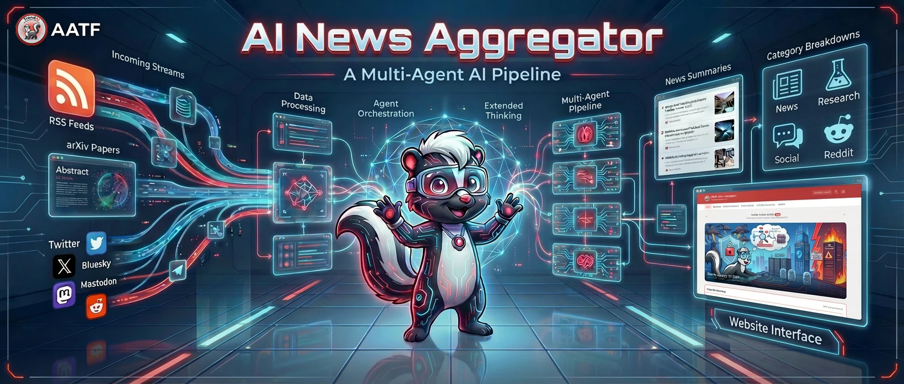
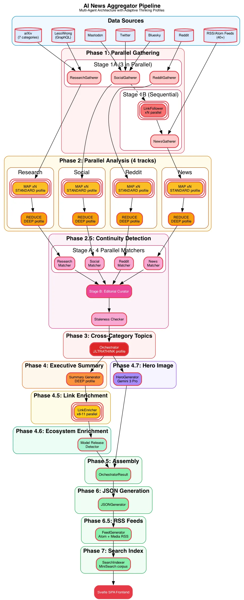
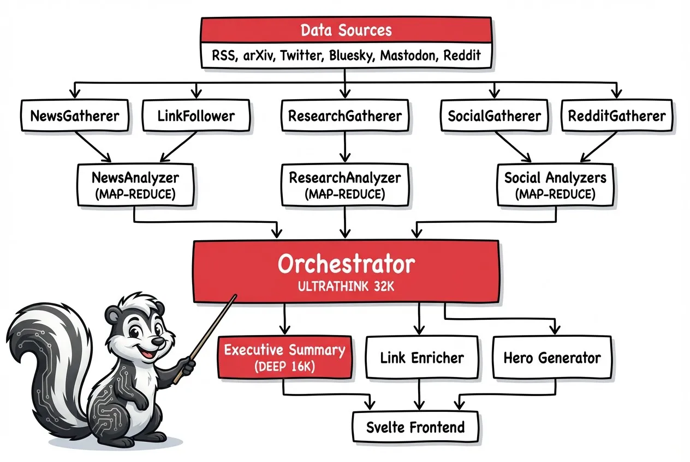

# AI News Aggregator



> Multi-agent AI news pipeline powered by native Gemini models with adaptive thinking

> **Live Site:** [https://news.aatf.ai](https://news.aatf.ai)

[](LICENSE)
[](https://www.python.org/)
[](https://www.docker.com/)

Daily AI/ML news briefings curated by specialized agents using adaptive thinking profiles. The publishing repository starts the hosted pipeline every morning at 3 AM ET, with the live site typically updated around 4 AM ET.

---

## Navigation

| Section | Description |
|---------|-------------|
| [What It Does](#what-it-does) | Key stats and capabilities |
| [How It Works](#how-it-works) | Pipeline phases, reasoning profiles, architecture |
| [Quick Start](#quick-start) | Docker and local setup |
| [Configuration](#configuration) | Provider modes, prompts, data sources |
| [Daily Automation](#daily-automation) | GitHub Actions publication workflow |
| [Features](#features) | Multi-agent, continuity detection, frontend |
| [Architecture](#architecture) | Directory structure, agent pairs, data output |
| [Frontend Development](#frontend-development) | Dev server, build, URL routes |
| [Operational Notes](#operational-notes) | Research sources, date semantics |
| [Local Development](#local-development) | Pipeline dev, hero regeneration |
| [Contributing](#contributing) | How to contribute |

---

## What It Does

A Python-based pipeline that collects AI/ML news from multiple sources, analyzes them using specialized agents with provider-aware adaptive thinking, and serves a modern Svelte SPA frontend.

**Key Stats:**
- **40+ curated RSS/Atom sources** plus Hugging Face Papers and AlphaXiv
- **Date-aligned trending papers** selected from AI-focused topics
- **6 social platforms** (Twitter, Bluesky, Mastodon, Reddit, LessWrong, research blogs)
- **Adaptive reasoning profiles** for lightweight triage through cross-category synthesis
- **Daily hero image** generated with AATF skunk mascot

---

## How It Works



### The Multi-Phase Pipeline

| Phase | Description | Reasoning Profile |
|-------|-------------|----------------|
| **0. Ecosystem Context** | Load AI model release dates for LLM grounding | - |
| **1. Parallel Gathering** | 4 gatherers collect from RSS, Hugging Face Papers, AlphaXiv, Twitter, Reddit, Bluesky, and Mastodon | - |
| **2. Parallel Analysis** | MAP-REDUCE pattern: batch items (75 each), analyze, then synthesize | STANDARD -> DEEP |
| **2.5. Continuity Detection** | Track developing stories, detect rehashes, link related coverage | - |
| **3. Cross-Category Topics** | Identify 3-6 themes spanning all categories | ULTRATHINK |
| **4. Executive Summary** | Generate daily briefing (500-800 words) | DEEP |
| **4.5. Link Enrichment** | Inject internal links to referenced items | STANDARD |
| **4.6. Ecosystem Enrichment** | Auto-detect new model releases from news | STANDARD |
| **4.7. Hero Image** | Generate branded banner with Gemini 3 Pro | - |
| **5-7. Output** | JSON data generation + MiniSearch corpus (client-built index) | - |

### Adaptive Thinking Profiles

These are internal pipeline profiles rather than provider token budgets. Native
Gemini routes map them to `thinking_level`; Claude routes retain their adaptive
effort or legacy manual-budget mapping.

| Profile | Gemini Thinking | Default Route | Use Case |
|---------|-----------------|---------------|----------|
| QUICK | `low` | Flash-Lite | Filters, matching, sentiment |
| STANDARD | `medium` | Flash-Lite | Batch analysis, enrichment |
| DEEP | `high` | Flash or Flash-Lite by caller | Ranking, executive summary |
| ULTRATHINK | `high` | Flash | Cross-category topic detection |

### Agent Architecture



---

## Quick Start

### Option A: Docker (Recommended)

```bash
# Clone the repository
git clone https://github.com/flyryan/ai-news-aggregator.git
cd ai-news-aggregator

# Create config file
cp config/providers.yaml.example config/providers.yaml
# Edit config/providers.yaml with your API keys

# Build and run
docker-compose build
docker-compose up -d
```

Open [http://localhost:8080](http://localhost:8080)

### Option B: Local Development

```bash
# Clone and setup
git clone https://github.com/flyryan/ai-news-aggregator.git
cd ai-news-aggregator

# Python setup
python3 -m venv venv
source venv/bin/activate
pip install -r requirements.txt

# Create config
cp config/providers.yaml.example config/providers.yaml
# Edit config/providers.yaml with your API keys

# Run pipeline
python3 run_pipeline.py --config-dir ./config --data-dir ./data --web-dir ./web

# Frontend development (separate terminal)
cd frontend
npm install
npm run dev
# Open http://localhost:5173
```


### Option C: Web-Only Docker (Recommended for AWS / VPS)

If you only need to **serve the frontend** (pipeline runs elsewhere and pushes data via git), use the lightweight web-only image. It skips Python, Playwright, and all scraper dependencies — resulting in a ~50 MB image instead of ~2 GB.

```bash
# Clone the repository
git clone https://github.com/flyryan/ai-news-aggregator.git
cd ai-news-aggregator

# Build and run (web-only)
docker compose -f docker-compose.web.yml up -d --build
```

The web-only image uses `nginx:alpine` and mounts `web/data` and `web/assets` as volumes so a `git pull` on the host picks up new pipeline data. Frontend source changes require rebuilding the web-only image because the Svelte bundle under `web/_app/` is built on the host and is not committed.

```bash
git fetch origin
git reset --hard origin/main
docker compose -f docker-compose.web.yml up -d --build
```

Open [http://localhost:7100](http://localhost:7100)

---

## Utility Scripts

Two standalone helper scripts live in `scripts/` for operational debugging:

```bash
# Check the latest pipeline log and emit a human-readable summary
python3 scripts/pipeline_health.py

# Same report as structured JSON
python3 scripts/pipeline_health.py --json

# Warm a headless browser on LessWrong, cache cookies, and test GraphQL access
python3 scripts/lesswrong_cookie_fetch.py --after 2026-03-27 --before 2026-03-28
```

`lesswrong_cookie_fetch.py` exists because direct `requests` calls to LessWrong GraphQL may hit Vercel's bot challenge (HTTP 429), while a real browser context can sometimes pass. The helper tries direct GraphQL first, then cached browser cookies, then a fresh Playwright warm-up before giving up. Browser cookies are cached in `~/.cache/lesswrong_cookies.json`.

### Manual Pipeline Run

```bash
# Run pipeline (local)
python3 run_pipeline.py

# Run pipeline (Docker)
docker exec ai-news-aggregator python3 /app/run_pipeline.py

# Run for a specific date
python3 run_pipeline.py -d 2026-01-05

# Enable scheduled collection (legacy local/Docker cron only)
ENABLE_CRON=true docker-compose up -d

# Resume after a crash (auto-detects latest checkpoint)
python3 run_pipeline.py --resume

# Resume from a specific phase (loads earlier phases from checkpoint)
python3 run_pipeline.py --resume-from 3      # Re-run topic detection onward
python3 run_pipeline.py --resume-from 4.7    # Just regenerate hero image
```

## Daily Automation

The `flyryan/ai-news-aggregator` repository runs the pipeline daily with GitHub Actions. The workflow is intentionally guarded so scheduled runs only execute in that repository:

```yaml
if: github.repository == 'flyryan/ai-news-aggregator'
```

Forks and self-hosted copies can change the publishing repository by editing the workflow guard, schedule, provider secrets, and `PIPELINE_BASE_URL`. The repository-specific provider file remains ignored; production should store it in `PIPELINE_PROVIDERS_YAML`.

### Schedule

GitHub Actions cron runs in UTC, so the workflow has two UTC entries and a local-time guard. Only the cron entry whose nominal scheduled time maps to `3 AM America/New_York` continues; the other exits as a no-op. GitHub may start scheduled runners late, so the guard uses the schedule expression instead of the runner's wall-clock start time. This means the workflow is listed with two schedules but only one scheduled run proceeds each day.

### Required Repository Secrets

Set these on the publishing repository:

| Secret | Purpose |
|--------|---------|
| `PIPELINE_PROVIDERS_YAML` | Full contents of ignored `config/providers.yaml`; preferred for production because it preserves the exact provider mode and image settings |
| `GEMINI_API_KEY` | Google AI Studio key used by the native Gemini LLM routes |
| `ANTHROPIC_API_KEY` | LLM/proxy API key, also used by the fallback generated provider config |
| `ANTHROPIC_API_BASE` | OpenAI-compatible proxy base URL when used |
| `TWITTERAPI_IO_KEY` | Optional Twitter/X collection |
| `SCRAPECREATORS_API_KEY` | Reddit collection via the ScrapeCreators API (replaces the dead free Reddit `.json` endpoint); required for Reddit data |
| `REDDIT_PROXY_URL` | Legacy proxy for direct Reddit requests; no longer used by the Reddit gatherer (ScrapeCreators goes direct) |
| `LESSWRONG_PROXY_URL` | Optional HTTP(S) or SOCKS proxy URL for LessWrong GraphQL/browser fallback requests |
| `PIPELINE_PROXY_URL` | Optional HTTP(S) or SOCKS proxy URL for the whole pipeline; useful when hosted runner egress is blocked by multiple sources |
| `MULLVAD_ACCOUNT` | Optional Mullvad account number; used to create a WireGuard tunnel when neither `PIPELINE_PROXY_URL` nor `REDDIT_PROXY_URL` is set |
| `MULLVAD_WG_PRIVATE_KEY` | Optional stable WireGuard private key for the CI Mullvad device; avoids creating a new Mullvad device on every run |
| `GOOGLE_API_KEY` | Optional Gemini native image generation when not using a proxy image provider |
| `PIPELINE_PUSH_TOKEN` | Optional PAT if the default `GITHUB_TOKEN` is not enough for downstream webhook behavior |

### Optional Repository Variables

| Variable | Default | Purpose |
|----------|---------|---------|
| `ANTHROPIC_MODEL` | `claude-4.8-opus-aws` | Legacy single-provider model ID; ignored when `llm.routes` is configured |
| `PIPELINE_BASE_URL` | `https://news.aatf.ai` | Base URL used in feeds |
| `PIPELINE_IMAGE_MODEL` | `gemini-3-pro-image-preview` | Native Gemini image model used by fallback config |
| `PIPELINE_COMMIT_PATHS` | `web/data config/model_releases.yaml config/ecosystem_context.yaml` | Space-separated generated outputs to commit |
| `REDDIT_USER_AGENT` | `AI-News-Aggregator/1.0 (by u/flyryan)` | User-Agent sent to Reddit API requests |
| `NEWS_USER_AGENT` | `REDDIT_USER_AGENT` value | User-Agent sent to RSS/feed sources |
| `MULLVAD_RELAY_FILTER` | `us` | Mullvad WireGuard relay hostname prefix used for CI egress |
| `LLM_TIMEOUT_SECONDS` | `240` | Hosted LLM request timeout override; supersedes provider YAML timeout |
| `LLM_MAX_CONCURRENT_REQUESTS` | `8` | Async LLM request cap per provider route; with three routes, the default maximum is 24 active LLM requests |
| `LLM_ADAPTIVE_MAX_TOKENS` | `65536` | Response output ceiling for adaptive-thinking calls; separate from analysis profile/effort |
| `LLM_MAX_RETRIES` | `2` | Anthropic SDK retry count for transient request failures |
| `LLM_LOG_REQUESTS` | `true` | Log queue/start/done metadata without raw prompt content |
| `LLM_HEARTBEAT_SECONDS` | `60` | Emit progress logs for in-flight LLM requests; set `0` to disable |
| `LLM_METRICS_PATH` | `data/llm_metrics.jsonl` | JSONL diagnostics file uploaded as a workflow artifact |

### Manual Dry Runs

Use `workflow_dispatch` with `commit_outputs=false` to run the full hosted pipeline without committing or pushing. The workflow uploads `web/data`, `config/model_releases.yaml`, and `config/ecosystem_context.yaml` as an artifact for inspection. Set the optional `anthropic_model` dispatch input to test a one-off model ID for legacy single-provider configs; it is intentionally ignored when `llm.routes` is configured.

Every hosted run also uploads a `pipeline-diagnostics` artifact when available. It includes `data/llm_metrics.jsonl` and cost reports, which are useful for comparing model IDs/providers without committing diagnostics to the public site.

### Profile-Aware LLM Routing

Production can route async LLM calls by analysis profile and caller. Routes
inherit root settings unless overridden; RPM, input TPM, and RPD limits are
enforced in-process:

```yaml
llm:
  mode: "gemini"
  api_key: "${GEMINI_API_KEY}"
  model: "gemini-3.5-flash-lite"
  requests_per_minute: 15
  tokens_per_minute: 250000
  requests_per_day: 500
  timeout: 600
  routes:
    - id: "gemini-bulk"
      model: "gemini-3.5-flash-lite"
      profiles: ["QUICK", "STANDARD", "DEEP"]
    - id: "gemini-quality"
      model: "gemini-3.6-flash"
      requests_per_minute: 5
      requests_per_day: 20
      profiles: ["STANDARD", "DEEP", "ULTRATHINK"]
      caller_patterns:
        - "orchestrator.*"
        - "*_analyzer.reduce_rank"
        - "link_enricher.*"
```

Routes with matching caller patterns are preferred over profile-only routes.
Retryable transport failures, quota exhaustion, 429s, and 5xx responses fail
over to the next route. Configurations without selectors retain round-robin
routing.

Hosted diagnostics include provider IDs, provider model IDs, route attempts, fallback source, retry reason, adaptive thinking type, analysis profile, adaptive effort, response token ceiling, queue/active counts, and content block counts. They never include prompt text, API keys, or provider URLs.

### Generated Outputs

The daily commit includes persistent generated site and grounding outputs:

- `web/data/**` for the frontend, search index, and hero images
- `config/model_releases.yaml` for curated and auto-detected model release facts
- `config/ecosystem_context.yaml` as the last successful OpenRouter-enriched grounding cache

Runtime scrape data, checkpoints, and logs under `data/**` and `logs/**` stay ignored. They are useful for local debugging but are not public site state.

### Reddit Collection on Hosted Runners

The Reddit gatherer collects via the **ScrapeCreators API** (`SCRAPECREATORS_API_KEY`), which unblocks Reddit server-side. Reddit's free `.json` endpoint and OAuth are both dead, so this is required for Reddit data. The gatherer sends its requests directly (`requests` `trust_env=False`) and ignores `REDDIT_PROXY_URL` and the pipeline-wide `ALL_PROXY` exports; set `SCRAPECREATORS_PROXY_URL` only if that specific traffic must be proxied. Per-run credit usage and the remaining balance are logged and shown in the end-of-run cost summary.

If multiple sources block hosted runner egress, set `PIPELINE_PROXY_URL`; the workflow exports it as the standard `HTTP_PROXY`, `HTTPS_PROXY`, and `ALL_PROXY` variables for the pipeline process (with `api.scrapecreators.com` in `NO_PROXY` so Reddit stays direct). The RSS gatherer fetches feeds with `requests`, so SOCKS proxy URLs are honored when `PySocks` is installed. LLM clients bypass those proxy environment variables by default; set `LLM_TRUST_ENV_PROXY=true` only when LLM traffic should also use the runner proxy.

LessWrong uses GraphQL for date-range research collection. The LessWrong helper tries direct GraphQL first, then cached cookies, then a browser cookie warm-up only if needed. If hosted egress is blocked only for LessWrong, set `LESSWRONG_PROXY_URL`; otherwise `PIPELINE_PROXY_URL` is reused for direct GraphQL, cached-cookie requests, and the Playwright browser fallback.

The GitHub workflow also supports `MULLVAD_ACCOUNT`: when set and both `PIPELINE_PROXY_URL` and `REDDIT_PROXY_URL` are empty, it creates a WireGuard tunnel with Mullvad's official `wg-tools` script, narrows the route to Mullvad's SOCKS proxy address, and sets `PIPELINE_PROXY_URL` plus `REDDIT_PROXY_URL` to `socks5h://10.64.0.1:1080` for the pipeline. Set `MULLVAD_WG_PRIVATE_KEY` to reuse one registered CI device across runs.

---

## Configuration

All configuration is done via `config/providers.yaml`. Copy the example file and customize:

```bash
cp config/providers.yaml.example config/providers.yaml
```

### LLM Provider

Supports four modes:

| Mode | Description | Auth | Thinking Support |
|------|-------------|------|------------------|
| `anthropic` (default) | Direct Anthropic API | x-api-key header | Adaptive thinking on Opus 4.8 |
| `openai-compatible` | LiteLLM, vLLM, or other proxies | Bearer token | Depends on proxy passthrough support |
| `openrouter` | Direct OpenRouter chat/completions API | ****** | Standard chat completions (no Anthropic thinking blocks) |
| `gemini` | Native Google Gemini API | Google AI Studio API key | Native Gemini thinking levels |

**Native Gemini API:**

```yaml
llm:
  mode: "gemini"
  api_key: "${GEMINI_API_KEY}"
  model: "gemini-3.5-flash-lite"
  max_output_tokens: 65536
  requests_per_minute: 15
  tokens_per_minute: 250000
  requests_per_day: 500
```

**Direct Anthropic API:**

```yaml
llm:
  mode: "anthropic"
  api_key: "${ANTHROPIC_API_KEY}"  # Use env var reference
  # base_url: "https://api.anthropic.com"  # Default, uncomment to override
  model: "claude-4.8-opus-anthropic"  # Or your endpoint's Opus 4.8 alias
  timeout: 600
```

**OpenAI-compatible proxies (LiteLLM, etc.):**

```yaml
llm:
  mode: "openai-compatible"
  api_key: "${PROXY_API_KEY}"
  base_url: "https://your-litellm-proxy.example.com"
  model: "claude-4.8-opus-aws"  # Your proxy's model alias
  timeout: 600
```

**Direct OpenRouter free model:**

```yaml
llm:
  mode: "openrouter"
  api_key: "${OPENROUTER_API_KEY}"
  base_url: "https://openrouter.ai/api/v1"
  model: "nvidia/nemotron-3-ultra-550b-a55b:free"
  max_output_tokens: 16384
  timeout: 600
```

### Image Provider (Optional)

Hero image generation is optional. Comment out the entire `image:` section to skip.

| Mode | Description | Requirements |
|------|-------------|--------------|
| `native` (default) | Google Gemini API via google-genai SDK | Google AI API key |
| `openai-compatible` | OpenAI-compatible image endpoint | Proxy endpoint + key |

```yaml
image:
  mode: "native"
  api_key: "${GOOGLE_API_KEY}"
  model: "gemini-3-pro-image-preview"
```

If no image provider is configured, the pipeline runs successfully without hero images.

### Pipeline Settings

```yaml
pipeline:
  base_url: "http://localhost:8080"  # Your deployment URL (used in RSS feeds)
  lookback_hours: 24  # How far back to collect news
```

### Environment Variables

You can reference environment variables in your YAML config using `${VAR_NAME}` syntax:

```bash
export ANTHROPIC_API_KEY="your-key-here"
export GEMINI_API_KEY="your-key-here"
export GOOGLE_API_KEY="your-key-here"
export TWITTERAPI_IO_KEY="your-key-here"  # Optional, for Twitter collection
export SCRAPECREATORS_API_KEY="your-key-here"  # For Reddit collection
```

| Variable | Description | Required |
|----------|-------------|----------|
| `GEMINI_API_KEY` | Google AI Studio key for native Gemini LLM routes | For `gemini` mode |
| `ANTHROPIC_API_KEY` | Anthropic API key | For `anthropic` mode |
| `GOOGLE_API_KEY` | Google AI API key | No (hero images) |
| `TWITTERAPI_IO_KEY` | TwitterAPI.io key ($0.15/1000 tweets) | No |
| `SCRAPECREATORS_API_KEY` | ScrapeCreators key for Reddit (~$0.99/1000 calls) | For Reddit |
| `REDDIT_PROXY_URL` | Legacy; no longer used for Reddit (ScrapeCreators goes direct) | No |
| `REDDIT_USER_AGENT` | User-Agent for Reddit requests | No |
| `LESSWRONG_PROXY_URL` | HTTP(S) or SOCKS proxy for LessWrong requests | No |
| `PIPELINE_PROXY_URL` | HTTP(S) or SOCKS proxy for the whole pipeline | No |
| `NEWS_USER_AGENT` | User-Agent for RSS/feed requests | No |
| `LLM_TRUST_ENV_PROXY` | Allow LLM clients to use `HTTP_PROXY`/`HTTPS_PROXY`/`ALL_PROXY`. Default: `false` | No |
| `LLM_TIMEOUT_SECONDS` | Override provider-config LLM request timeout. GitHub Actions default: `240` | No |
| `LLM_MAX_CONCURRENT_REQUESTS` | Async LLM request cap per provider route; `0` disables the cap. Default: `8` | No |
| `LLM_ADAPTIVE_MAX_TOKENS` | Response output ceiling for adaptive-thinking calls. It is not a thinking budget. Default: `65536` | No |
| `LLM_MAX_RETRIES` | Anthropic SDK retry count for transient request failures. Default: `2` | No |
| `LLM_LOG_REQUESTS` | Log LLM queue/start/done metadata without raw prompt content. Default: `true` | No |
| `LLM_HEARTBEAT_SECONDS` | Seconds between in-flight LLM progress logs. Default: `60`; set `0` to disable | No |
| `LLM_METRICS_PATH` | Optional JSONL path for per-request LLM metrics. GitHub Actions default: `data/llm_metrics.jsonl` | No |
| `ANALYZER_BATCH_SIZE` | Items per analyzer map batch. Default: `75` | No |
| `ANALYZER_MAX_CONCURRENT_BATCHES` | Per-category analyzer map concurrency. Default: `3` | No |
| `MULLVAD_ACCOUNT` | Mullvad account number for CI proxy setup | No |
| `MULLVAD_WG_PRIVATE_KEY` | Stable WireGuard private key for the CI Mullvad device | No |
| `MULLVAD_RELAY_FILTER` | Mullvad relay hostname prefix for CI tunnel selection | No |
| `TARGET_DATE` | Report date (YYYY-MM-DD) | No |
| `ENABLE_CRON` | Enable scheduled collection | No |
| `COLLECTION_SCHEDULE` | Cron schedule (default: `0 6 * * *`) | No |
| `TZ` | Timezone (default: `America/New_York`) | No |

### Prompt Customization

All LLM prompts are externalized to `config/prompts.yaml`. You can customize analysis behavior without changing code:

```yaml
# Example: Customize the executive summary prompt
orchestration:
  executive_summary: |
    Write a structured executive summary of today's AI news...

    FORMAT YOUR SUMMARY LIKE THIS:
    #### Top Story
    ...
```

Prompt categories:
- **gathering** - Link relevance decisions
- **analysis** - Category-specific analysis (news, research, social, reddit)
- **orchestration** - Cross-category topic detection, executive summary
- **post_processing** - Link enrichment, ecosystem enrichment

Variables use `${var}` syntax and are resolved at runtime.

### Adding Data Sources

Edit files in `config/`:

| Source Type | Config File | Format |
|-------------|-------------|--------|
| RSS feeds | `rss_feeds.txt` | One URL per line |
| Research blogs | `research_feeds.txt` | LessWrong, AI Alignment Forum URLs |
| Twitter | `twitter_accounts.txt` | Usernames (requires TWITTERAPI_IO_KEY) |
| Bluesky | `bluesky_accounts.txt` | Handles (e.g., `karpathy.bsky.social`) |
| Mastodon | `mastodon_accounts.txt` | Full addresses (e.g., `user@mastodon.social`) |
| Reddit | `reddit_subreddits.txt` | Subreddit names |

### Model Release Tracking

The pipeline tracks AI model releases to ground LLM analysis:

```yaml
# config/model_releases.yaml
openai:
  GPT-5.2:
    ga_date: "2026-01-10"
    api_date: "2026-01-11"
```

Phase 4.6 auto-detects new releases from daily news and updates this file.

---

## Features

### Multi-Agent Architecture
- **4 Gatherer agents** collecting from different source types in parallel
- **4 Analyzer agents** with MAP-REDUCE batching for scalability
- **Continuity detection** tracks developing stories across days

### Continuity Detection
Automatically identifies when today's stories continue from previous coverage:
- **Continuation types**: `new_development` (builds on prior story), `mainstream_pickup` (gains wider attention), `community_reaction` (discussion response), `rehash` (repetitive coverage), `follow_up` (next chapter)
- **Smart ranking**: Items flagged as `rehash` can be demoted from top stories
- **2-day lookback**: Compares against items from the past 2 days

### Analysis Profiles And Adaptive Thinking
- QUICK/STANDARD/DEEP/ULTRATHINK are internal AATF analysis profiles, not provider API values
- Native Gemini routes map these profiles to low/medium/high `thinking_level`
- Caller patterns reserve Gemini 3.6 Flash for ranking and cross-category synthesis
- Claude remains an optional provider with adaptive or legacy manual thinking
- `LLM_ADAPTIVE_MAX_TOKENS` sets the response output ceiling and is separate from thinking depth
- Request logs use `analysis_profile`, `adaptive_effort`, and `response_max_tokens` so the internal profile names are not confused with provider thinking levels or manual token budgets
- QUICK/STANDARD/DEEP/ULTRATHINK remain as internal profile names for callers and older Claude models
- ULTRATHINK profile for complex cross-category analysis
- **Cost tracking**: Per-phase breakdown with input/output/cache token tracking, logged at end of each run

### Ecosystem Grounding
Prevents hallucinations about AI model releases by injecting accurate release dates into analyzer prompts:
- **Dual date tracking**: GA (General Availability) date vs API date for each model
- **Curated source of truth**: `config/model_releases.yaml` with verified dates from Nov 2025+
- **OpenRouter integration**: Auto-discovers new models and API availability dates
- **Agent enrichment**: Phase 4.6 auto-detects new model releases from daily news and updates the context

### Collection Status Tracking
Each pipeline run tracks collection status per source:
- **Status values**: `success`, `partial` (some items collected), `failed`
- **Per-source tracking**: News, Research, Social, Reddit
- **Per-platform tracking**: Twitter, Bluesky, Mastodon (within Social)
- Status is included in `summary.json` and displayed in the frontend

### Pipeline Reliability
- **Phase tracking**: End-of-run summary showing status, timing, and details for every phase
- **Checkpoint/resume**: Each major phase saves a checkpoint to `data/checkpoints/`; use `--resume` for crash recovery or `--resume-from N` to re-run specific phases
- **Hero image fallback**: When topic detection fails, hero generation falls back to top category themes
- **LLM routing diagnostics**: Queue/start/done logs include caller, provider, attempt, active/queued counts, input size, timing, and retry/fallback metadata without raw prompt content
- **Analyzer recovery**: MAP batches log the item count and prompt size before sending; unusable or truncated JSON responses are split into smaller sub-batches before items are dropped
- **Clean logging**: httpx noise suppressed; MAP-REDUCE batches show per-batch progress with category tags

### Data Sources

| Category | Sources | Collection Method |
|----------|---------|-------------------|
| **News** | 26 curated RSS/Atom feeds + linked articles | RSS/Atom + LLM-guided link following |
| **Research** | 19 research feeds + Hugging Face Papers + AlphaXiv | Date-addressed API + rolling trend API + RSS/Atom + LessWrong GraphQL |
| **Social** | Twitter, Bluesky, Mastodon | TwitterAPI.io + free APIs |
| **Reddit** | Configurable subreddits | ScrapeCreators API (listings + post comments) |

### Frontend Features
- **AATF Branding** - Trend Red (#E63946) color scheme with skunk mascot
- **Calendar Navigation** - Browse historical reports by date
- **Full-text Search** - Client-side MiniSearch index built in a Web Worker from a compact corpus
- **Dark Mode** - System-aware with manual toggle
- **Responsive Design** - Mobile-first with Tailwind CSS

### Daily Hero Image
Each report includes a generated hero image featuring the AATF skunk mascot in a scene representing the day's top stories, created via Gemini 3 Pro.

### AI Observatory MCP Server

The project includes an **MCP (Model Context Protocol)** server that exposes the daily aggregated intelligence to any compatible AI assistant (like Claude Desktop). This transforms the Observatory's JSON data into an active vector knowledge base.

**Available MCP Tools:**
- `list_available_dates`: Retrieves all dates with available analysis.
- `get_daily_summary(date)`: Retrieves the executive summary and top topics for a given date.
- `search_intelligence(query)`: Performs keyword searches across all historical executive summaries and top topics.

**How to connect Claude Desktop:**
1. Install dependencies: `pip install -r mcp_requirements.txt`
2. Add the server to your `claude_desktop_config.json`:
```json
{
  "mcpServers": {
    "ai-observatory": {
      "command": "python",
      "args": ["/absolute/path/to/ai-news-aggregator/mcp_server.py"]
    }
  }
}
```
3. Restart Claude Desktop and you will see the new tools available (hammer icon).

---

## Architecture

### Directory Structure

```
ai-news-aggregator/
├── agents/
│   ├── llm_client.py          # Anthropic client with adaptive/manual thinking profiles
│   ├── base.py                # BaseGatherer, BaseAnalyzer classes
│   ├── orchestrator.py        # Main coordinator
│   ├── ecosystem_context.py   # AI model release dates for LLM grounding
│   ├── link_enricher.py       # Adds internal links to summaries
│   ├── cost_tracker.py        # LLM API cost tracking
│   ├── phase_tracker.py       # Phase status tracking and end-of-run summary
│   ├── gatherers/             # News, Research, Social, Reddit gatherers
│   ├── analyzers/             # Category-specific analyzers
│   └── continuity/            # Story tracking across days
├── generators/
│   ├── json_generator.py      # JSON data for SPA frontend
│   ├── search_indexer.py      # MiniSearch corpus builder
│   └── hero_generator.py      # Daily hero image with skunk mascot
├── frontend/                  # Svelte SPA
│   ├── src/
│   │   ├── lib/components/    # UI components
│   │   ├── lib/stores/        # State management
│   │   ├── lib/services/      # Data loading, search
│   │   └── routes/            # SvelteKit routing
│   └── static/assets/         # Logo, fonts
├── config/
│   ├── providers.yaml         # Provider configuration
│   ├── prompts.yaml           # LLM prompts (customizable)
│   ├── rss_feeds.txt          # RSS feed URLs
│   ├── model_releases.yaml    # AI model release dates
│   └── ...                    # Other source lists
├── data/
│   ├── raw/                   # Collected JSON
│   ├── processed/             # Analyzed JSON + cost reports
│   └── checkpoints/           # Phase checkpoints for resume (per-date)
├── web/                       # Generated output
├── assets/                    # Pipeline diagrams
├── run_pipeline.py            # Entry point
├── Dockerfile
└── docker-compose.yml
```

### Agent Pairs

| Category | Gatherer | Analyzer Focus |
|----------|----------|----------------|
| **News** | RSS + linked articles from social | Product releases, company news |
| **Research** | Hugging Face Papers + AlphaXiv + LessWrong GraphQL | Trending papers, breakthroughs |
| **Social** | Twitter, Bluesky, Mastodon | Discussions, reactions |
| **Reddit** | Reddit via ScrapeCreators API | Community debates |

### Data Output

```
web/data/
├── index.json              # Date manifest
├── search-corpus.json      # Search corpus (30-day window); index built in-browser
├── feeds/                  # Atom RSS feeds
│   ├── main.xml
│   ├── summaries-executive.xml
│   └── ...
└── {YYYY-MM-DD}/
    ├── summary.json        # Executive summary + top items
    ├── hero.webp           # Daily hero image
    ├── news.json           # Full news items
    ├── research.json       # Full research items
    ├── social.json         # Full social items
    └── reddit.json         # Full reddit items
```

---

## Frontend Development

```bash
cd frontend
npm install              # Install dependencies
npm run dev              # Start dev server (http://localhost:5173)
npm run build            # Build production (outputs to ../web)
npm run check            # TypeScript type checking
```

### URL Routes

| Route | Content |
|-------|---------|
| `/` | Redirects to latest date |
| `/?date=2026-01-05` | Specific date overview |
| `/?date=2026-01-05&category=research` | Category page |
| `/archive` | Calendar browser |
| `/feeds` | RSS feed directory |
| `/about` | Project info and AI disclaimer |

---

## Operational Notes

### Trending Paper Collection
- Hugging Face Daily Papers is queried for the exact report coverage date and supports historical backfills.
- AlphaXiv uses the smallest rolling trend window containing the coverage date, then filters papers to that date.
- AlphaXiv has no historical ranking snapshots beyond 90 days; older backfills continue with Hugging Face and research blogs.
- `ALPHAXIV_SORT` (default `Hot`), `ALPHAXIV_PAGE_SIZE`, `ALPHAXIV_MAX_PAGES`, and `RESEARCH_TRENDING_MAX_PAPERS` control ranking and collection limits.

### Date Semantics
- `TARGET_DATE` = report date
- Coverage period = day BEFORE report date (00:00-23:59 ET)
- Example: `TARGET_DATE=2026-01-05` covers news from January 4th

### LessWrong Collection
Uses GraphQL API instead of RSS because RSS doesn't support date-range queries - only returns the ~10-20 most recent posts which scroll off within hours. The helper tries direct GraphQL, cached cookies, and a Playwright browser warm-up; `LESSWRONG_PROXY_URL` can target only this source when CI egress is the problem.

### Item IDs
12-character SHA256 hashes (~280 trillion unique values) for compact, stable URLs.

---

## Local Development

### Pipeline Development

```bash
# Create and activate virtual environment
python3 -m venv venv
source venv/bin/activate

# Install dependencies
pip install -r requirements.txt

# Run pipeline
python3 run_pipeline.py --config-dir ./config --data-dir ./data --web-dir ./web
```

### Resuming Failed Runs

```bash
# Auto-resume from latest checkpoint (crash recovery)
python3 run_pipeline.py --resume

# Resume from a specific phase
python3 run_pipeline.py --resume-from 3      # Re-run from topic detection
python3 run_pipeline.py --resume-from 4.7    # Re-run hero image only
python3 run_pipeline.py --resume-from 2      # Re-run from analysis

# Checkpoints persist in data/checkpoints/{date}/
# Full run always saves fresh checkpoints
```

### Hero Image Regeneration

The `regenerate_hero.py` script regenerates hero images for daily reports.

```bash
# Basic usage (prompts for confirmation)
python3 scripts/regenerate_hero.py 2026-01-06

# Auto-confirm (no prompt)
python3 scripts/regenerate_hero.py 2026-01-06 -y

# With custom prompt override
python3 scripts/regenerate_hero.py 2026-01-06 --prompt "Custom scene description"

# Regenerate ALL dates
python3 scripts/regenerate_hero.py -a

# Skip specific dates or ranges
python3 scripts/regenerate_hero.py -a -s 2026-01-05              # Skip one date
python3 scripts/regenerate_hero.py -a -s 2026-01-05:2026-01-08   # Skip range (inclusive)
python3 scripts/regenerate_hero.py -a -s 2026-01-01,2026-01-05   # Skip multiple

# Parallel processing (faster for --all)
python3 scripts/regenerate_hero.py -a -t 4                        # 4 parallel threads

# Edit existing image instead of regenerating
python3 scripts/regenerate_hero.py 2026-01-06 -e "Add a coffee cup to the scene"
```

### Other Utility Scripts

| Script | Purpose |
|--------|---------|
| `daily_pipeline.sh` | Legacy local cron wrapper: pulls latest, runs pipeline, auto-commits and pushes results |
| `post_pipeline_verify.sh` | Verifies the public site picked up today's generated data and can force a configured host git sync |
| `cleanup_external_links.py` | Strips external links from topic descriptions and re-enriches with internal links only |
| `convert_hero_images.py` | One-time migration: converts PNG hero images to WebP format |
| `patch_news_notice.py` | One-time: adds collection start notice to early dates |

`post_pipeline_verify.sh` is host-agnostic. Set `AWS_HOST` directly, or set `AWS_PROFILE` plus `AWS_INSTANCE_ID` or `AWS_INSTANCE_NAME` so the script can resolve the current EC2 public IP. Set `REBUILD_WEB=true` when the deployed change includes frontend source or other web-image changes.

---

## Requirements

- **Python 3.10+**
- **Node.js 18+** (for frontend development)
- **Docker & Docker Compose** (for containerized deployment)
- **Gemini 3.5 Flash-Lite and Gemini 3.6 Flash** (default analysis routes)
- **Gemini 3 Pro** (optional, for hero image generation)

### API Keys

| Service | Required | Cost | Purpose |
|---------|----------|------|---------|
| Google AI Studio | Yes | Quota tier | Native Gemini LLM analysis |
| Anthropic API | No | Pay-per-token | Optional alternative LLM provider |
| Google AI images | No | Pay-per-image | Hero images |
| TwitterAPI.io | No | $0.15/1000 tweets | Twitter collection |
| Mullvad | No | Subscription | Optional hosted-runner egress proxy |

---

## Contributing

Contributions are welcome!

- **Bug Reports**: [Open an issue](https://github.com/flyryan/ai-news-aggregator/issues)
- **Feature Requests**: [Open an issue](https://github.com/flyryan/ai-news-aggregator/issues)
- **Pull Requests**: Fork, make changes, submit PR

Please ensure your contributions maintain backwards compatibility with existing configurations.

---

## License

Apache License 2.0 - See [LICENSE](LICENSE) file for details.

Copyright 2026 AI Acceleration Task Force (AATF)

---

## Built by TrendAI

**AI Acceleration Task Force** | [TrendAI](https://www.trendmicro.com)

Originally built as an internal tool to keep our team informed about AI developments, now open-sourced so others can run their own instances.

---

**Interested in being a Trender?** [Join us!](https://www.trendmicro.com/en_us/about/careers.html)
