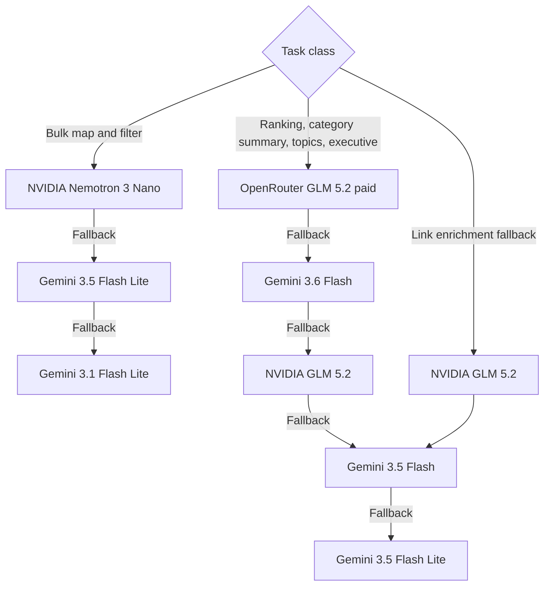
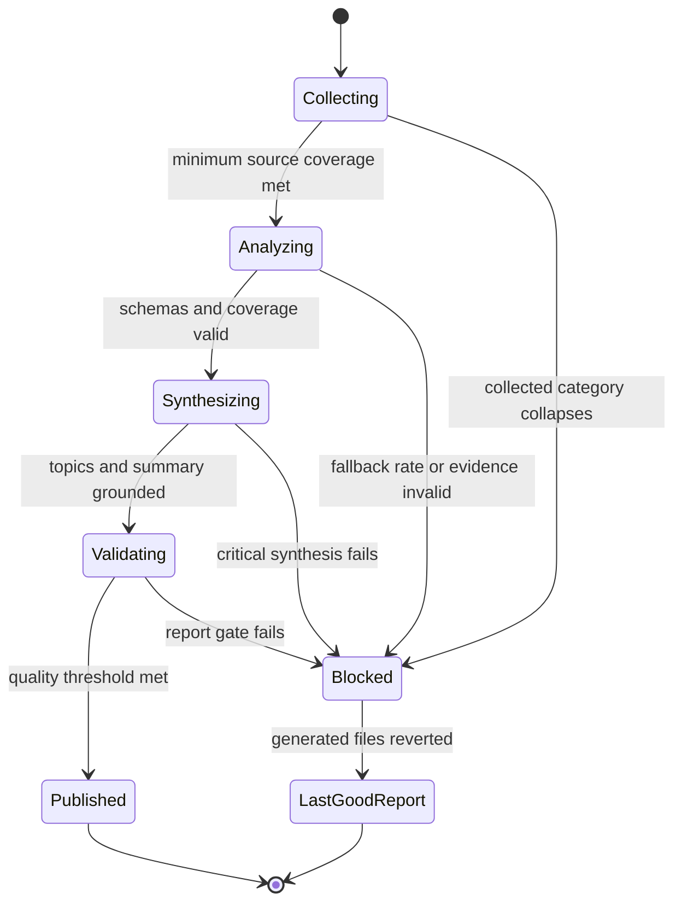

<div align="center">

# AI Observatory

### Daily, evidence-grounded intelligence on the AI ecosystem

[Live Observatory](https://ai-observatory.vercel.app) · [Architecture](architecture.md) · [Quick start](QUICK_START.md) · [Deployment](DEPLOYMENT_GUIDE.md) · [Roadmap](TODO.md)


</div>

AI Observatory turns a broad daily signal stream into a concise, traceable briefing for executives, strategists, researchers, and builders. It collects current material, filters and ranks it, detects themes spanning multiple categories, generates an evidence-backed executive summary, validates the report, and publishes a static site.

The pipeline is designed to degrade safely: provider fallbacks, checkpoints, schema validation, deterministic editorial checks, and a publish gate prevent a superficially successful run from replacing the last good report with incomplete output.

## ✨ What it delivers

- **Four daily intelligence views:** AI News, Research, Social signals from X, and GitHub Trending.
- **Cross-category synthesis:** topics are accepted only when supported by current items from at least two populated categories.
- **Evidence-grounded writing:** summaries return exact current-item IDs and cannot use historical summaries as fresh evidence.
- **Consistent LLM quality:** price-guarded paid MiniMax M3 handles both per-item analysis and high-value synthesis; Gemini and NVIDIA routes provide task-specific fallbacks.
- **Operational visibility:** phase status, collection funnels, LLM telemetry, token usage, provider costs, and GetXAPI calls are persisted with the report.
- **Static-first publishing:** generated JSON feeds a fast SvelteKit frontend and machine-readable discovery artifacts.

## 🧭 Pipeline at a glance


```mermaid
flowchart LR
    subgraph Sources[Current sources]
        RSS[43 news feeds]
        WEB[13 direct web sources]
        HN[Hacker News]
        PAPERS[HF Papers + AlphaXiv]
        RESEARCH[19 feeds + LessWrong + 4 dated hubs]
        X[X via GetXAPI]
        GH[GitHub Trending]
    end

    subgraph Pipeline[Daily intelligence pipeline]
        COLLECT[Collect and normalize]
        FILTER[Keyword filter and deduplicate]
        ANALYZE[Batch analyze and rank]
        SYNTH[Detect topics and synthesize]
        ENRICH[Deterministic-first link enrichment]
        GUARD[Quality and editorial gates]
    end

    subgraph Outputs[Published outputs]
        JSON[Versioned report JSON]
        SITE[SvelteKit static site]
        INDEX[llms.txt and ai-index.json]
        METRICS[Cost and LLM telemetry]
    end

    Sources --> COLLECT --> FILTER --> ANALYZE --> SYNTH --> ENRICH --> GUARD
    GUARD --> JSON --> SITE
    GUARD --> INDEX
    GUARD --> METRICS
```

## 🗂️ Active source inventory

The configuration files—not this table—are the source of truth. Counts reflect the current repository configuration.

| Category | Active inputs | Collection path | Notes |
|---|---|---|---|
| **AI News** | 43 RSS/Atom feeds, 13 direct web pages, Hacker News, links expanded from X posts | `NewsGatherer`, `WebScraperGatherer`, `HackerNewsGatherer`, `LinkFollower` | Includes Kimi, OECD.AI, NIST CAISI, The Batch, Databricks AI-filtered posts, MiniMax News, and Z.ai's official release stream. New direct sources use exact-date deterministic parsing and no LLM calls. |
| **Research** | Hugging Face Daily Papers, AlphaXiv Trending, 19 RSS/Atom feeds, LessWrong, 4 dated web hubs | `ResearchGatherer` | Includes Anthropic Research and Economic Futures, Arena, Epoch AI, Meta AI Research, and OpenAI Research-tagged entries. HTML hubs use deterministic exact-date parsing and no LLM calls. |
| **Social** | 170 configured X accounts | `SocialGatherer` | `@NVIDIAAI` is retained while the broader corporate `@nvidia` account is excluded. GetXAPI queries at most 20 accounts per paid request. |
| **GitHub Trending** | GitHub Trending | `GitHubTrendingGatherer` | Repositories are analyzed as a separate report category. |

Bluesky, Mastodon, Reddit, YouTube, Product Hunt, Discord, and Slack are **not active pipeline sources**. See [AI news sources](ai_news_sources.md) for maintenance rules and the exact configuration entry points.

## 🧠 LLM strategy

Routing is caller-aware, so high-volume classification and high-impact synthesis do not compete for the same quota.


```mermaid
flowchart TD
    TASK{Task class}

    TASK -->|Bulk map and filter| NEMO[NVIDIA Nemotron 3 Nano]
    NEMO -->|Fallback| GFL[Gemini 3.5 Flash Lite]
    GFL -->|Fallback| G31[Gemini 3.1 Flash Lite]

    TASK -->|Ranking, category summary, topics, executive| ORGLM[OpenRouter GLM 5.2 paid]
    ORGLM -->|Fallback| G36[Gemini 3.6 Flash]
    G36 -->|Fallback| NVGLM[NVIDIA GLM 5.2]
    NVGLM -->|Fallback| G35[Gemini 3.5 Flash]
    G35 -->|Fallback| G35L[Gemini 3.5 Flash Lite]

    TASK -->|Link enrichment fallback| LINKGLM[NVIDIA GLM 5.2]
    LINKGLM --> G35
```

The executive-summary context has a strict boundary:

```text
=== PREVIOUS DAYS' COVERAGE (HISTORICAL; DO NOT REPORT AS CURRENT) ===
...
=== END PREVIOUS DAYS' COVERAGE ===

=== TODAY'S DATA (CURRENT EVIDENCE) ===
... exact current item IDs, titles and summaries ...
=== END TODAY'S DATA ===
```

Historical reports help the model avoid repetition; only records inside today’s section may support new claims.

## 🛡️ Reliability model


```mermaid
stateDiagram-v2
    [*] --> Collecting
    Collecting --> Analyzing: minimum source coverage met
    Collecting --> Blocked: collected category collapses
    Analyzing --> Synthesizing: schemas and coverage valid
    Analyzing --> Blocked: fallback rate or evidence invalid
    Synthesizing --> Validating: topics and summary grounded
    Synthesizing --> Blocked: critical synthesis fails
    Validating --> Published: quality threshold met
    Validating --> Blocked: report gate fails
    Blocked --> LastGoodReport: generated files reverted
    Published --> [*]
    LastGoodReport --> [*]
```

Key safeguards include:

- checkpoint-based resume after recoverable failures;
- route cooldowns, retries, and fallback chains;
- schema validation and fallback-rate limits;
- fail-open News filtering when an LLM emits invalid JSON;
- evidence coverage checks for topics and executive output;
- deterministic sanitization of unwanted branding and unsupported claims;
- quality scoring and a final report validator before Git commit;
- automatic restoration of the last good report when validation fails.

## 🚀 Quick start

Requirements: Python 3.11+, Node.js 20+, and API keys for the routes you enable.

```bash
git clone https://github.com/BlockFrame/AI-Observatory.git
cd AI-Observatory

python3.11 -m venv .venv
source .venv/bin/activate
python -m pip install -r requirements.txt
python -m playwright install chromium

cp .env.example .env
npm run install:frontend
```

At minimum, configure `GEMINI_API_KEY`, `OPENROUTER_API_KEY`, and `NVIDIA_API_KEY`. Add `GETXAPI_KEY` to collect X posts.

Run the pipeline and frontend:

```bash
python run_pipeline.py --date 2026-08-10
npm run dev
```

Useful recovery commands:

```bash
python run_pipeline.py --resume
python run_pipeline.py --resume-from 4.5
python scripts/validate_report.py --web-dir ./web --date 2026-08-10
```

See [Quick start](QUICK_START.md) for setup details and [Deployment guide](DEPLOYMENT_GUIDE.md) for GitHub Actions and Vercel.

## ⚙️ Configuration

| File | Purpose |
|---|---|
| `config/providers.yaml` | LLM routes, quotas, fallbacks, timeouts, and pipeline defaults |
| `config/prompts.yaml` | Analysis, synthesis, and enrichment prompt contracts |
| `config/rss_feeds.txt` | AI News RSS/Atom feeds |
| `config/research_feeds.txt` | Research feeds and LessWrong routing entry |
| `config/research_web_sources.txt` | Deterministic, date-verifiable Research pages without feeds |
| `config/research_reference_sources.txt` | Authoritative static hubs excluded from daily collection |
| `config/twitter_accounts.txt` | X accounts queried through GetXAPI |
| `config/web_scraper_sources.txt` | Direct pages for sources without usable feeds |
| `config/ecosystem_context.yaml` | Grounding context used by synthesis |
| `config/model_releases.yaml` | Release-date grounding data |

Secrets are loaded from environment variables. Never commit provider keys or proxy credentials.

## 📦 Outputs and interfaces

Each successful run writes `web/data/<YYYY-MM-DD>/summary.json`, including category reports, evidence IDs, collection status, analysis funnels, phase status, quality information, and LLM telemetry. Cost details are written beside the report.

The repository also maintains:

- `llms.txt` for language-model-readable discovery;
- `ai-index.json` for structured indexing;
- `mcp_server.py` for MCP-compatible access;
- the static SvelteKit site under `frontend/`.

## 🧪 Validation

Unit tests use mocks and do not consume paid LLM or GetXAPI quota.

```bash
python -m unittest discover -s tests -p '*_test.py'
npm run check
npm run build
```

The GitHub Actions workflow runs the critical regression suite before any paid API call, then validates the generated report before publishing it.

## 🏗️ Repository map

```text
agents/                 Gatherers, analyzers, routing, orchestration and guards
config/                 Providers, prompts, feeds and grounding data
frontend/               SvelteKit application
generators/             JSON and optional visual-output generation
scripts/                Validation, deployment and operational utilities
tests/                  Mocked regression and integrity tests
web/data/<date>/         Versioned reports and telemetry
.github/workflows/       Scheduled generation and publishing
```

## 🤝 Contributing

Keep changes evidence-preserving and quota-aware. When adding a source, update its configuration file and [source inventory](ai_news_sources.md). When changing synthesis, add a mocked regression test that proves current-item grounding and failure behavior.

## 📄 License

Licensed under the [Apache License 2.0](LICENSE). AI Observatory evolved from the open-source `ai-news-aggregator` project and now maintains its own collection, reliability, routing, editorial, and publishing architecture.
