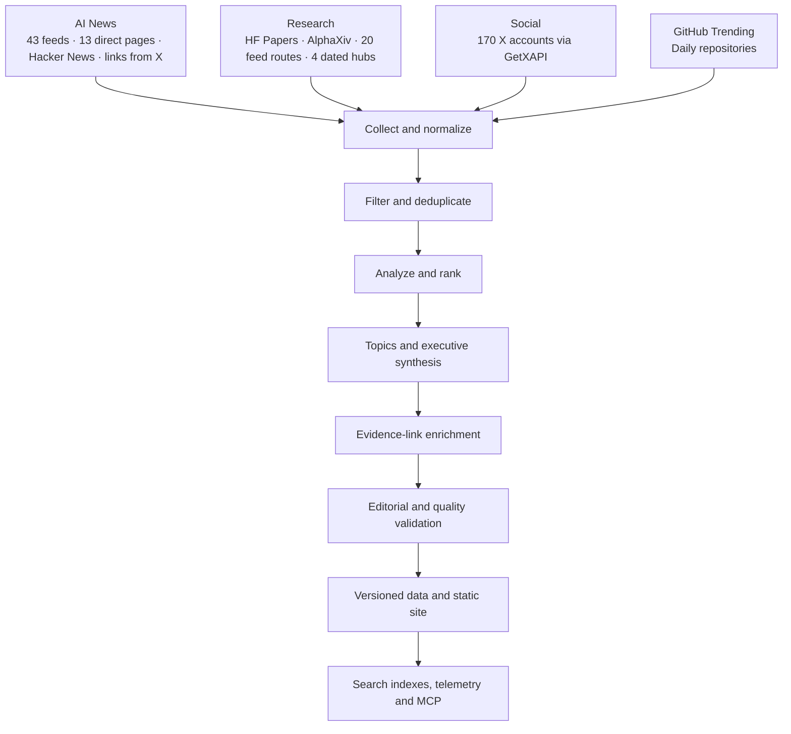
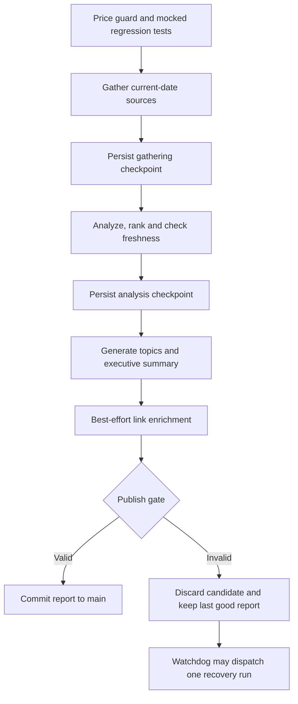

<div align="center">

# R[AI]DAR

### Evidence-linked daily intelligence on the AI ecosystem

#### An open-source product by [Wiredframe](https://www.wiredframe.xyz)

[Live R\[AI\]DAR](https://radar.wiredframe.xyz) · [Documentation](docs/README.md) · [Wiki](https://github.com/BlockFrame/wiredframe-radar/wiki) · [Architecture](docs/architecture.md) · [Getting started](docs/getting-started.md) · [AIDLC](docs/ai-development-lifecycle.md) · [Governance](docs/governance.md) · [Roadmap](docs/roadmap.md)


</div>

R[AI]DAR by Wiredframe turns a broad daily signal stream into a concise, traceable briefing for executives, strategists, researchers, and builders. It collects current material, filters and ranks it, detects themes spanning multiple categories, generates an evidence-backed executive summary, validates the report, and publishes a static site.

The pipeline is designed to degrade safely: provider fallbacks, checkpoints, schema validation, deterministic editorial checks, and a publish gate prevent a superficially successful run from replacing the last good report with incomplete output.

## ✨ What it delivers

- **Four daily intelligence views:** AI News, Research, Social signals from X, and GitHub Trending.
- **Curated AI directories:** searchable model and tool catalogs plus a structured directory of researchers, builders, founders, and industry voices to follow.
- **Cross-category synthesis:** topics are accepted only when supported by current items from at least two populated categories.
- **Evidence-grounded writing:** summaries return exact current-item IDs and cannot use historical summaries as fresh evidence.
- **Consistent LLM quality:** price-guarded MiniMax M3 handles both high-volume analysis and high-value synthesis; Gemini and NVIDIA routes provide workload-specific fallbacks.
- **Operational visibility:** phase status, collection funnels, LLM telemetry, token usage, provider costs, and GetXAPI calls are persisted with the report.
- **Static-first publishing:** generated JSON feeds a fast SvelteKit frontend and machine-readable discovery artifacts.

## 🧭 Pipeline at a glance


```mermaid
flowchart TD
    NEWS[AI News<br/>43 feeds · 13 direct pages · Hacker News · links from X]
    RESEARCH[Research<br/>HF Papers · AlphaXiv · 20 feed routes · 4 dated hubs]
    SOCIAL[Social<br/>170 X accounts via GetXAPI]
    GITHUB[GitHub Trending<br/>Daily repositories]

    NEWS --> COLLECT[Collect and normalize]
    RESEARCH --> COLLECT
    SOCIAL --> COLLECT
    GITHUB --> COLLECT
    COLLECT --> FILTER[Filter and deduplicate]
    FILTER --> ANALYZE[Analyze and rank]
    ANALYZE --> SYNTH[Topics and executive synthesis]
    SYNTH --> ENRICH[Evidence-link enrichment]
    ENRICH --> VALIDATE[Editorial and quality validation]
    VALIDATE --> PUBLISH[Versioned data and static site]
    PUBLISH --> DISCOVERY[Search indexes, telemetry and MCP]
```

## 🗂️ Active source inventory

The configuration files—not this table—are the source of truth. Counts reflect the current repository configuration.

| Category | Active inputs | Collection path | Notes |
|---|---|---|---|
| **AI News** | 43 RSS/Atom feeds, 13 direct web pages, Hacker News, and qualifying articles linked from X | `NewsGatherer`, `WebScraperGatherer`, `HackerNewsGatherer`, `LinkFollower` | Hacker News and direct-page results are merged into News before deduplication. The direct collectors include Kimi, NIST CAISI, The Batch, MiniMax News, and Z.ai releases; date-verifiable routes use deterministic extraction. |
| **Research** | Hugging Face Daily Papers, AlphaXiv Trending, 20 configured feed routes including LessWrong, and 4 dated web hubs | `ResearchGatherer` | LessWrong is queried through its date-range GraphQL route. The dated hubs are Anthropic Research, Anthropic Economic Futures, Arena Research, and Epoch AI; undated entries are discarded. |
| **Social** | 170 configured X accounts | `SocialGatherer` | `@NVIDIAAI` is retained while the broader corporate `@nvidia` account is excluded. GetXAPI queries at most 20 accounts per paid request. |
| **GitHub Trending** | GitHub Trending | `GitHubTrendingGatherer` | Repositories are analyzed as a separate report category. |

See the [source inventory](docs/sources.md) for the exact routes, category decisions, and maintenance rules.

## 🧠 LLM strategy

Routing is caller-aware, so high-volume analysis, critical synthesis, and link repair use separate eligibility rules.

| Workload | Primary path | Fallback path |
|---|---|---|
| **Bulk analysis and editorial utilities** | OpenRouter MiniMax M3 | Gemini 3.5 Flash Lite → Gemini 3.1 Flash Lite |
| **Ranking and critical synthesis** | OpenRouter MiniMax M3 | Gemini 3.6 Flash → NVIDIA GLM 5.2 → Gemini 3.5 Flash → Gemini 3.5 Flash Lite |
| **Link enrichment** | Deterministic entity/title matching | Isolated MiniMax M3 call only for unresolved evidence blocks; if it fails, the already-generated report remains publishable without those links |

The complex MiniMax route covers small-batch analysis, reduce/rank, category summaries, Topic Detection, and Executive Summary. Its OpenRouter price is checked before dependency installation, source collection, GetXAPI calls, or any LLM request; the run stops early if the configured promotional ceiling is exceeded.

The executive-summary context has a strict boundary:

```text
=== PREVIOUS DAYS' COVERAGE (HISTORICAL; DO NOT REPORT AS CURRENT) ===
...
=== END PREVIOUS DAYS' COVERAGE ===

=== TODAY'S DATA (CURRENT EVIDENCE) ===
... exact current item IDs, titles and summaries ...
=== END TODAY'S DATA ===
```

Historical reports help the model avoid repetition; only records inside today’s section may support new claims.

## 🛡️ Reliability model


```mermaid
flowchart TD
    PREFLIGHT[Price guard and mocked regression tests] --> GATHER[Gather current-date sources]
    GATHER --> GCHECK[Persist gathering checkpoint]
    GCHECK --> ANALYZE[Analyze, rank and check freshness]
    ANALYZE --> ACHECK[Persist analysis checkpoint]
    ACHECK --> SYNTH[Generate topics and executive summary]
    SYNTH --> ENRICH[Best-effort link enrichment]
    ENRICH --> GATE{Publish gate}
    GATE -->|Valid| COMMIT[Commit report to main]
    GATE -->|Invalid| PRESERVE[Discard candidate and keep last good report]
    PRESERVE --> WATCHDOG[Watchdog may dispatch one recovery run]
```

Key safeguards include:

- a promotional-price guard and mocked regression suite before any paid collection or model call;
- date-pinned collection and a reusable gathering checkpoint, so a rerun for the same report date can reuse successful X collection;
- checkpoint-based resume with selective repair of failed gathering categories;
- route cooldowns, bounded retries, provider disabling, and caller-specific fallback chains;
- fail-open News filtering when an LLM emits invalid JSON;
- a maximum 20% per-category analysis fallback rate for categories with at least five analyzed items;
- current-item evidence validation for executive output and two-category evidence requirements for every top topic;
- deterministic sanitization of unwanted branding and unsupported claims;
- deterministic report and category quality gates (70/100 report, 55/100 category) before Git commit;
- non-blocking link enrichment: malformed links are rejected, but missing links do not waste an otherwise valid report;
- diagnostic artifact upload, preservation of the last good report, and a watchdog-limited recovery dispatch when publication fails.

## 🚀 Quick start

Requirements: Python 3.11+, Node.js 20+, and API keys for the routes you enable.

```bash
git clone https://github.com/BlockFrame/wiredframe-radar.git
cd wiredframe-radar

python3.11 -m venv .venv
source .venv/bin/activate
python -m pip install -r requirements.txt
python -m playwright install chromium

cp .env.example .env
npm run install:frontend
```

At minimum, configure `GEMINI_API_KEY` and `OPENROUTER_API_KEY`. Add `NVIDIA_API_KEY` for the GLM quality fallback, `GETXAPI_KEY` to collect X posts, and `GOOGLE_API_KEY` for optional hero-image generation.

Run the pipeline and frontend:

```bash
python run_pipeline.py --date 2026-08-10
npm run dev
```

Useful recovery commands:

```bash
python run_pipeline.py --resume
python run_pipeline.py --resume-from 4.5
python scripts/validate_report.py --web-dir ./web --date 2026-08-10
```

See [Getting started](docs/getting-started.md) for setup details and the [deployment guide](docs/deployment.md) for GitHub Actions and Vercel.

## ⚙️ Configuration

| File | Purpose |
|---|---|
| `config/providers.yaml` | LLM routes, quotas, fallbacks, timeouts, and pipeline defaults |
| `config/prompts.yaml` | Analysis, synthesis, and enrichment prompt contracts |
| `config/rss_feeds.txt` | AI News RSS/Atom feeds |
| `config/research_feeds.txt` | Research feeds and LessWrong routing entry |
| `config/research_web_sources.txt` | Deterministic, date-verifiable Research pages without feeds |
| `config/research_reference_sources.txt` | Authoritative static hubs excluded from daily collection |
| `config/twitter_accounts.txt` | X accounts queried through GetXAPI |
| `config/web_scraper_sources.txt` | Direct pages for sources without usable feeds |
| `config/ecosystem_context.yaml` | Grounding context used by synthesis |
| `config/model_releases.yaml` | Release-date grounding data |

Secrets are loaded from environment variables. Never commit provider keys or proxy credentials.

## 📦 Outputs and interfaces

Each successful run writes `web/data/<YYYY-MM-DD>/summary.json`, including category reports, evidence IDs, collection status, analysis funnels, phase status, quality information, and LLM telemetry. Cost details are written beside the report.

The repository also maintains:

- `llms.txt` for language-model-readable discovery;
- `ai-index.json` for structured indexing;
- `mcp_server.py` for MCP-compatible access;
- the static SvelteKit site under `frontend/`.

## 🧪 Validation

Unit tests use mocks and do not consume paid LLM or GetXAPI quota.

```bash
python -m unittest discover -s tests -p '*_test.py'
npm run check
npm run build
```

The GitHub Actions workflow runs the critical regression suite before any paid API call, then validates the generated report before publishing it.

## 🏗️ Repository map

```text
agents/                 Gatherers, analyzers, routing, orchestration and guards
config/                 Providers, prompts, feeds and grounding data
docs/                   Architecture, operations, sources and roadmap
frontend/               SvelteKit application
generators/             JSON and optional visual-output generation
scripts/                Validation, deployment and operational utilities
tests/                  Mocked regression and integrity tests
web/data/<date>/         Versioned reports and telemetry
.github/workflows/       Scheduled generation and publishing
```

## 🤝 Contributing

Keep changes evidence-preserving and quota-aware. When adding a source, update its configuration file and [source inventory](docs/sources.md). When changing synthesis, add a mocked regression test that proves current-item grounding and failure behavior.

The project uses short-lived branches and reviewed pull requests into `main`; it does not maintain a permanent `dev` branch. Start with the [contribution guide](.github/CONTRIBUTING.md), then review [project governance](docs/governance.md), the [Code of Conduct](.github/CODE_OF_CONDUCT.md), and the [security policy](.github/SECURITY.md).

## 🙏 Acknowledgments

R[AI]DAR began as a fork of Ryan Duff's open-source [AI News Aggregator](https://github.com/flyryan/ai-news-aggregator). We gratefully acknowledge that project for proving how effective a multi-agent daily intelligence workflow can be and recommend it to anyone looking for the original implementation and its design choices.

R[AI]DAR has since evolved into an independent product with its own source strategy, model routing, evidence-linking system, quality controls, cost governance, frontend, and publishing architecture. Our thanks and endorsement of the upstream project remain an important part of this project's history.

## 📄 License

Licensed under the [Apache License 2.0](LICENSE).
