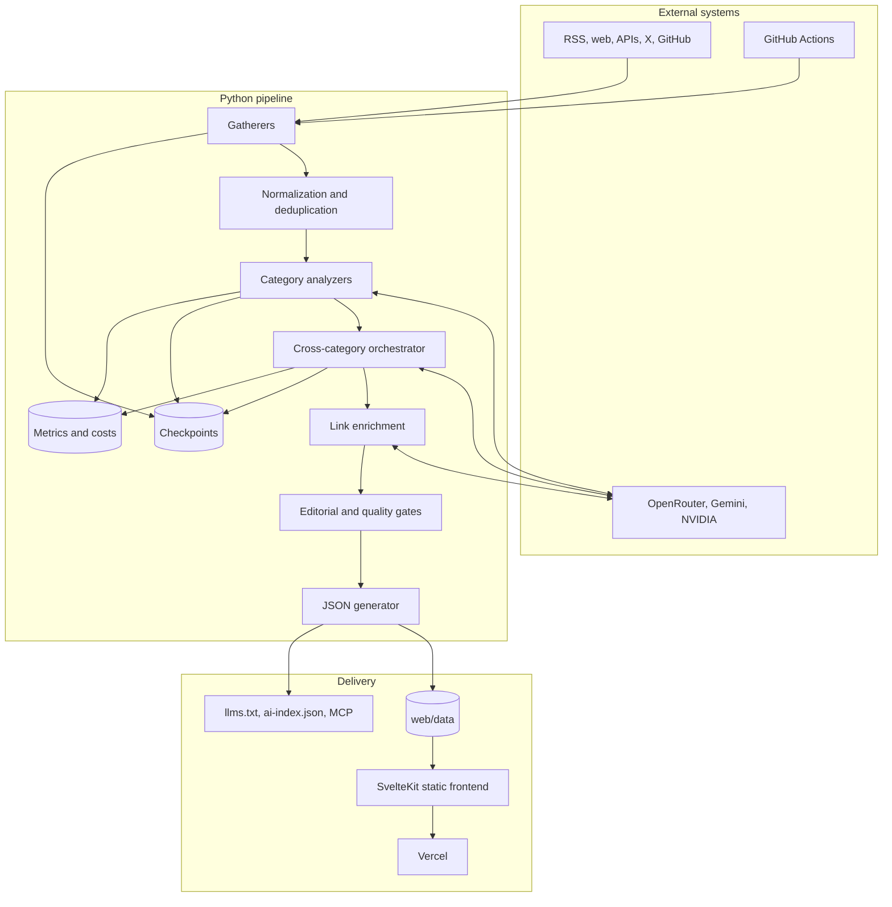
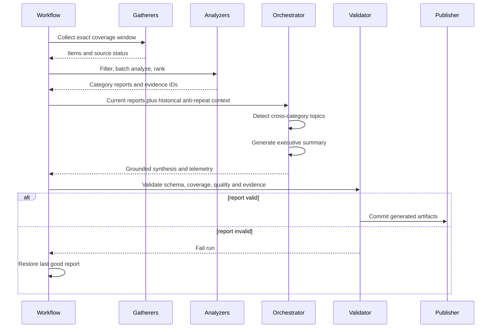

# Architecture

Wiredframe Radar is a checkpointed, multi-stage data pipeline with a static publishing layer. Collection and analysis are category-specific; topic detection and executive synthesis operate across categories only after evidence has been normalized and validated.

## System topology

## Processing sequence

## Context boundary

Historical executive summaries are loaded only to prevent repetition. `agents/summary_context.py` wraps them in a closed historical section, then opens a separate current-evidence section containing current topic candidates and exact item records. Both the live orchestrator and `scripts/regenerate_summary.py` use this shared builder.

The model must return evidence IDs from current records. Validation rejects missing IDs, unknown IDs, and insufficient category coverage.

## Failure boundaries

- **Source failure:** recorded per source; a category that collected data cannot silently collapse to zero during filtering or analysis.
- **LLM failure:** caller-aware fallback chains retry from the preferred route on each new task and cool down unhealthy routes.
- **Schema failure:** deterministic fallbacks preserve eligible inputs where safe; critical synthesis fails closed.
- **Editorial failure:** unsupported topics, prohibited branding, and invalid evidence are rejected or sanitized.
- **Publish failure:** the report validator blocks commit and the workflow retains the last known-good report.

## Data contracts

`OrchestratorResult` is serialized to `web/data/<date>/summary.json`. The frontend consumes static JSON and does not need a runtime application database. Report metadata includes collection status, analysis funnels, phase status, evidence IDs, quality diagnostics, and LLM telemetry.

Provider and prompt behavior is configuration-driven through `config/providers.yaml` and `config/prompts.yaml`.
