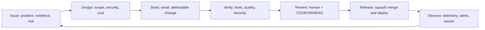

# AI development lifecycle

R[AI]DAR uses an evidence-led AI development lifecycle (AIDLC): AI can accelerate research and implementation, but every change remains attributable, testable, reviewable, and reversible.



## Required controls

| Stage | Control |
|---|---|
| Discovery | Issue form captures outcome, evidence, scope, and delivery risk. |
| Design | Changes identify source grounding, provider-cost impact, security boundaries, and rollback path. |
| Build | AI-assisted work is disclosed in the pull request; no secret or raw sensitive provider data enters the repository. |
| Verify | Mocked regression tests, CodeQL, dependency review, secret scanning, and the report publish gate provide independent checks. |
| Review | CODEOWNERS routes high-risk areas to the maintainer; branch protection enforces approval, current checks, and resolved conversations. |
| Release | Squash merges preserve a readable history; the daily pipeline remains a controlled exception for validated generated output. |
| Observe | GitHub Security, Actions diagnostics, LLM telemetry, cost reports, and the project board feed follow-up work. |

## Operating model

1. Create an issue with the relevant form and add `area:*`, `priority:*`, and `status:*` labels.
2. Move the issue through the GitHub Project: Triage → Ready → In progress → Review → Done.
3. Work in a short-lived branch; open a pull request using the template.
4. Resolve required checks and review feedback before merge.
5. Record incidents and recurring operational work as issues, linking the relevant workflow run or report date.

The daily data-publishing workflow writes only validated generated artifacts. It must retain a documented bypass when PR enforcement becomes active; all human-authored code and configuration changes follow the normal review path.

## Roadmap intake and Definition of Ready

The [public roadmap](roadmap.md) describes strategic direction, while the [GitHub AIDLC Project](https://github.com/users/BlockFrame/projects/2) owns execution. Every future roadmap capability must have one canonical GitHub issue using this specification:

```markdown
## User story
As a <user or operator>, I want <capability> so that <measurable value>.

## Outcome
Describe the observable result, not the proposed implementation.

## Acceptance criteria
- [ ] Verifiable product or operational behavior
- [ ] Failure and fallback behavior
- [ ] Mocked regression and contract coverage
- [ ] Documentation and compatibility requirements

## AIDLC controls
State delivery risk, dependencies, security and privacy boundaries,
recurring provider cost, external side effects, rollback, and observation plan.
```

An item can move from **Triage** to **Ready** only when:

1. the user value and non-goals are unambiguous;
2. acceptance criteria can be independently verified;
3. dependencies and relevant data contracts are identified;
4. provider cost and paid-call impact are bounded or explicitly approved;
5. security, privacy, evidence-grounding, and external side effects are assessed;
6. validation, migration, rollback, and post-release observation are defined; and
7. high-risk work has been split into reviewable design and implementation increments.

Priority expresses user and operational impact; Risk expresses delivery and failure exposure. They are independent Project fields and must not be inferred from one another.
