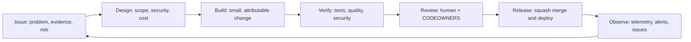

# AI development lifecycle

Wiredframe Radar uses an evidence-led AI development lifecycle (AIDLC): AI can accelerate research and implementation, but every change remains attributable, testable, reviewable, and reversible.

## Required controls

| Stage | Control |
|---|---|
| Discovery | Issue form captures outcome, evidence, scope, and delivery risk. |
| Design | Changes identify source grounding, provider-cost impact, security boundaries, and rollback path. |
| Build | AI-assisted work is disclosed in the pull request; no secret or raw sensitive provider data enters the repository. |
| Verify | Mocked regression tests, CodeQL, dependency review, secret scanning, and the report publish gate provide independent checks. |
| Review | CODEOWNERS routes high-risk areas to the maintainer; branch rules are introduced in evaluate mode before enforcement. |
| Release | Squash merges preserve a readable history; the daily pipeline remains a controlled exception for validated generated output. |
| Observe | GitHub Security, Actions diagnostics, LLM telemetry, cost reports, and the project board feed follow-up work. |

## Operating model

1. Create an issue with the relevant form and add `area:*`, `priority:*`, and `status:*` labels.
2. Move the issue through the GitHub Project: Triage → Ready → In progress → Review → Done.
3. Work in a short-lived branch; open a pull request using the template.
4. Resolve required checks and review feedback before merge.
5. Record incidents and recurring operational work as issues, linking the relevant workflow run or report date.

The daily data-publishing workflow writes only validated generated artifacts. It must retain a documented bypass when PR enforcement becomes active; all human-authored code and configuration changes follow the normal review path.
