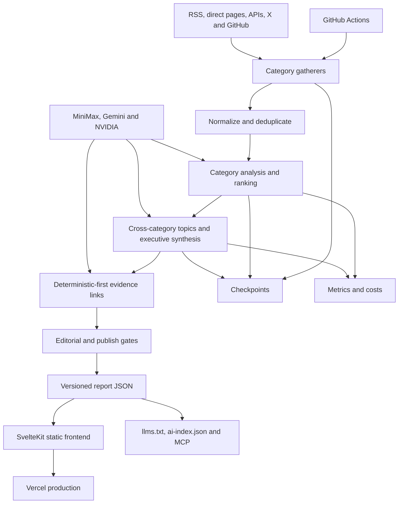
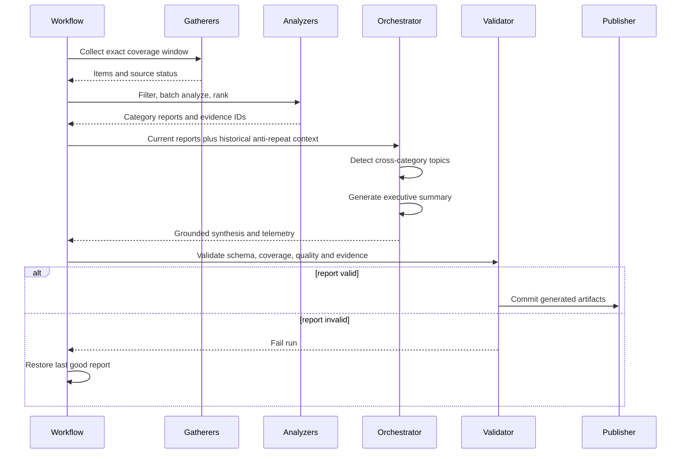

# Architecture

R[AI]DAR is a checkpointed, multi-stage data pipeline with a static publishing layer. Collection and analysis are category-specific; topic detection and executive synthesis operate across categories only after evidence has been normalized and validated.

## System topology

## Processing sequence

## Context boundary

Historical executive summaries are loaded only to prevent repetition. `agents/summary_context.py` wraps them in a closed historical section, then opens a separate current-evidence section containing current topic candidates and exact item records. Both the live orchestrator and `scripts/regenerate_summary.py` use this shared builder.

The model must return evidence IDs from current records. Validation rejects missing IDs, unknown IDs, and insufficient category coverage.

## Phase and recovery matrix

| Phase | Responsibility | LLM use | Checkpoint after phase | Resume behavior |
|---|---|---|---|---|
| 0 — Ecosystem Context | Load structured model/ecosystem grounding | None | None | Always reruns; fast and stateless |
| 1 — Gathering | Collect categories, normalize source status, and preserve the coverage window | None for normal collection | `gathering.json` | `--resume` restores successful categories and selectively recollects failed ones |
| 2 — Analysis | Filter, batch-analyze, reduce/rank, and build category reports | Bulk and complex routes | Written after 2.5/2.7 as `analysis.json` | Restores category reports, continuity, and staleness results |
| 2.5 — Continuity | Compare current items with recent coverage | Routed calls | Included in `analysis.json` | Reused with analysis |
| 2.7 — Staleness | Deterministically check model-release coverage | None | Included in `analysis.json` | Reused with analysis |
| 3 — Topic Detection | Produce grounded cross-category topics | Complex route | `topics.json` | Restores valid topics; an empty checkpoint may use deterministic current-item fallback topics |
| 4 — Executive Summary | Produce concise current-evidence synthesis | Complex route | None until enrichment completes | Replayed when no summary checkpoint exists |
| 4.5 — Link Enrichment | Attach deterministic links, then repair unresolved evidence semantically | Isolated paid route only when needed | `summary.json` checkpoint | Restores executive, category, and topic enrichment together |
| 4.6 — Ecosystem Enrichment | Detect grounded additions to ecosystem context | Routed call when eligible | None | Runs after a summary checkpoint resume |
| 4.7 — Hero Image | Optionally generate a visual asset | Optional image provider | None | Runs when configured; otherwise skipped |
| 5 — Assembly | Calculate telemetry/quality and serialize final result | None | Final report artifacts | Always assembles the candidate report |

Auto-resume selects the latest valid boundary in this order: summary → topics → analysis → gathering. A checkpoint is scoped to the target report date. Recovery must retain that date so fresh collection does not drift into a different coverage window.

## Failure boundaries

- **Source failure:** recorded per source; a category that collected data cannot silently collapse to zero during filtering or analysis.
- **LLM failure:** caller-aware fallback chains retry from the preferred route on each new task, cool down unhealthy routes, and disable routes that exhaust daily quota or disappear.
- **Schema failure:** deterministic fallbacks preserve eligible inputs where safe; critical synthesis fails closed.
- **Editorial failure:** unsupported topics, prohibited branding, and invalid evidence are rejected or sanitized.
- **Link-enrichment failure:** deterministic matching runs first; unresolved evidence may use the isolated MiniMax route, but missing links do not block an otherwise valid report.
- **Publish failure:** the report validator blocks commit, preserves diagnostics, and retains the last known-good report.

## Data contracts

`OrchestratorResult` is serialized to `web/data/<date>/summary.json`. The frontend consumes static JSON and does not need a runtime application database. Report metadata includes collection status, analysis funnels, phase status, evidence IDs, quality diagnostics, and LLM telemetry.

Provider and prompt behavior is configuration-driven through `config/providers.yaml` and `config/prompts.yaml`.

See [Data contracts](data-contracts.md), [LLM routing](llm-routing.md), and [Telemetry](telemetry.md) for the field-level and provider-level references.

[Back to documentation index](README.md)
