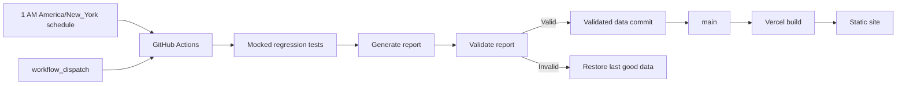

# Deployment guide

Production is split into two concerns: GitHub Actions generates and commits validated report data; Vercel builds and serves the static SvelteKit frontend.

## Deployment flow

## GitHub configuration

Required repository secrets:

- `GEMINI_API_KEY`
- `OPENROUTER_API_KEY`
- `NVIDIA_API_KEY`
- `PIPELINE_PUSH_KEY`, the private half of the repository-scoped writable deploy key used only to publish validated reports

Optional secrets:

- `GETXAPI_KEY` for X collection
- `GOOGLE_API_KEY` for optional hero-image generation
- `LESSWRONG_PROXY_URL` or `PIPELINE_PROXY_URL` for restricted egress
- Mullvad credentials when using the workflow-managed tunnel

Useful repository variables:

- `PIPELINE_BASE_URL`
- `PIPELINE_COMMIT_PATHS`
- `LLM_MAX_RETRIES`, `LLM_HEARTBEAT_SECONDS`, and route cooldown settings
- analyzer batch and fallback-rate controls

The canonical defaults are in `.github/workflows/daily-pipeline.yml` and `config/providers.yaml`.

The public half of `PIPELINE_PUSH_KEY` must be registered under **Settings → Deploy keys** with write access. The `Protect main` ruleset exempts deploy keys so the scheduled workflow can push its validated generated artifacts; no personal access token is required.

## Manual run

Open **Actions → Daily Pipeline → Run workflow**. Optional inputs support an explicit target date, checkpoint phase, model override, and disabling generated-output commits.

Before paid calls, the workflow runs mocked regression tests with production secrets shadowed. After generation, `scripts/validate_report.py` enforces the publish gate. Invalid output is reverted and never committed.

When publication fails, the workflow creates or updates one deduplicated GitHub Issue. A subsequent successful publication closes the incident automatically, keeping operational history inside the repository and its AIDLC project.

## Vercel

Import `BlockFrame/wiredframe-radar` into Vercel. The repository’s `vercel.json` and frontend configuration define the build. Use `https://radar.wiredframe.xyz` as the production domain and set the same value through `PIPELINE_BASE_URL`.

Vercel requires no runtime database for reports: generated JSON is versioned under `web/data/` and included in the static build.

## Diagnostics

Every workflow run uploads a `pipeline-diagnostics` artifact when available:

- `data/llm_metrics.jsonl`
- `web/data/*/cost_report.json`

The report itself includes phase status, collection status, analysis funnels, evidence coverage, and LLM telemetry. Start incident analysis from the first failed or degraded phase, then inspect provider/caller telemetry rather than relying only on the final job status.

## Rollback

The publish gate automatically keeps the last good report when generation is invalid. For a code rollback, revert the relevant commit through normal Git history; do not delete historical report directories or rewrite `main`.
