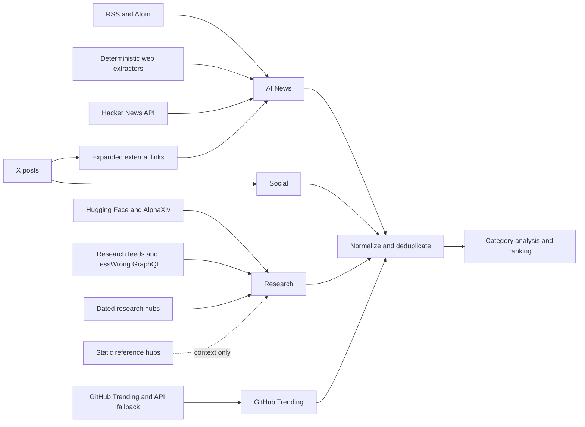

# Source handbook

This handbook defines the active R[AI]DAR collection surface, category boundaries, date and quality rules, operating signals, and the safe contribution workflow. Configuration under `config/` is authoritative; this document explains how that configuration is interpreted.

## Source architecture



### Executive inventory

| Category | Active collection inputs | Configured entries | Collection path | Paid collection impact |
|---|---|---:|---|---|
| AI News | RSS/Atom, deterministic pages, Hacker News, qualifying links from X | 43 feeds + 13 pages | `NewsGatherer`, `WebScraperGatherer`, `HackerNewsGatherer`, `LinkFollower` | None; linked articles reuse collected X posts |
| Research | Hugging Face Daily Papers, AlphaXiv, feeds, LessWrong GraphQL, dated hubs | 2 APIs + 20 feed routes + 4 pages | `ResearchGatherer` | None |
| Research references | Authoritative non-daily hubs | 9 pages | Context registry only; not emitted as fresh items | None |
| Social | X accounts through GetXAPI | 170 configured lines across 9 groups | `SocialGatherer` | Yes; up to 20 accounts per query chunk, with pagination |
| GitHub Trending | GitHub Trending plus API fallback | 1 collection route | `GitHubTrendingGatherer` | None |

Counts are configuration-line counts, not guaranteed daily item counts. A source may legitimately produce zero current-window items. The Social registry currently contains 170 lines and 169 case-insensitive unique handles because `jeffdean` and `JeffDean` are both present; runtime loading is line-based.

## Classification and freshness contract

### Category boundary

| Candidate | Correct destination | Rule |
|---|---|---|
| Dated reporting, product announcements, policy news, industry analysis | AI News | The item reports a current event and has a canonical publication date. |
| Papers, evaluation results, research posts, safety or security publications | Research | The item presents research evidence or a formal technical finding. |
| Posts authored by a monitored account | Social | The original X post is the evidence item; linked articles may additionally enter News. |
| Daily repository momentum | GitHub Trending | Repository signals remain separate from generic News. |
| SDK, framework, API, and release-note changes | Future Technical Updates | Do not distort strategic News ranking until the dedicated contract in issue #18 exists. |
| Authoritative page with no reliable publication stream | Research reference | Keep it as context; never present a static page edit as new daily research. |

Kimi, OECD.AI, and NIST CAISI are intentionally classified as News. OpenAI Research-tagged entries and Anthropic research pages are Research. GitHub Trending is always its own category.

### Date semantics

- The report date identifies the edition; the coverage window normally targets the previous calendar day in `America/New_York`.
- RSS and Atom entries must expose a parseable publication timestamp inside the exact window.
- Deterministic web sources discard undated candidates. A page modification timestamp is not sufficient evidence of a new article.
- Hugging Face is queried for the exact coverage date.
- AlphaXiv selects the smallest supported rolling ranking window, then retains only papers whose publication date matches the coverage date. It cannot backfill dates older than 90 days.
- LessWrong is queried by date range through GraphQL; its line in `research_feeds.txt` is a routing marker, not an ordinary RSS collection path.
- X search includes explicit `since` and `until` dates, and malformed timestamps are discarded rather than replaced with the current time.
- Same-date reruns may reuse a valid gathering checkpoint, including successful paid X collection.

## AI News inventory

### RSS and Atom feeds

`config/rss_feeds.txt` contains the complete 43-feed registry. `proxy=off` forces a direct session that ignores ambient proxy variables; `proxy=on` forces proxy routing. An untagged feed follows the pipeline default.

| Group | Sources |
|---|---|
| General AI and technology media (14) | [Ars Technica](https://feeds.arstechnica.com/arstechnica/index), [Wired AI](https://www.wired.com/feed/tag/ai/latest/rss), [VentureBeat AI](https://venturebeat.com/category/ai/feed/), [The Guardian AI](https://www.theguardian.com/technology/artificialintelligenceai/rss), [Artificial Intelligence News](https://www.artificialintelligence-news.com/feed/), [TechCrunch AI](https://techcrunch.com/category/artificial-intelligence/feed/), [The Verge AI](https://www.theverge.com/rss/ai-artificial-intelligence/index.xml), [MIT Technology Review AI](https://www.technologyreview.com/topic/artificial-intelligence/feed/), [IEEE Spectrum AI](https://spectrum.ieee.org/rss/artificial-intelligence/fulltext), [The Decoder](https://the-decoder.com/feed/), [The Register AI/ML](https://www.theregister.com/software/ai_ml/headlines.atom), [New Scientist AI](https://www.newscientist.com/subject/artificial-intelligence/feed/), [AI Business](https://aibusiness.com/rss.xml), [MarkTechPost Tech News](https://www.marktechpost.com/category/tech-news/feed/) |
| Policy and institutions (5) | [EU Digital Strategy](https://digital-strategy.ec.europa.eu/en/rss.xml), [EDPB](https://www.edpb.europa.eu/rss.xml), [AI Laws by State](https://www.ailawsbystate.com/blog/rss.xml), [AI Law Tracker](https://ai-law-tracker.com/feed.xml), [OECD.AI AI Wonk](https://wp.oecd.ai/feed/) |
| Labs, platforms, and engineering (14) | [Hugging Face](https://huggingface.co/blog/feed.xml), [Databricks](https://www.databricks.com/blog/feed.xml), [Google AI](https://blog.google/technology/ai/rss/), [Microsoft AI](https://www.microsoft.com/en-us/ai/blog/feed/), [AWS Machine Learning](https://aws.amazon.com/blogs/machine-learning/feed/), [NVIDIA Generative AI](https://blogs.nvidia.com/blog/tag/generative-ai/feed/), [GitHub Copilot](https://github.blog/tag/github-copilot/feed/), [OpenAI Blog](https://openai.com/blog/rss.xml), [Microsoft Research](https://www.microsoft.com/en-us/research/feed/), [Google DeepMind](https://deepmind.google/blog/feed), [Qwen](https://qwenlm.github.io/blog/index.xml), [Mistral AI](https://mistral.ai/rss.xml), [Arize](https://arize.com/feed/), [Cognition](https://devin.ai/rss.xml) |
| Analysis and newsletters (3) | [Every — Chain of Thought](https://every.to/chain-of-thought/feed), [Latent Space](https://www.latent.space/feed), [SemiAnalysis](https://semianalysis.com/feed/) |
| Frameworks, data infrastructure, and builder tools (7) | [LangChain](https://blog.langchain.com/rss.xml), [CrewAI](https://blog.crewai.com/rss/), [Weaviate](https://weaviate.io/blog/rss.xml), [Qdrant](https://qdrant.tech/blog/index.xml), [Redis](https://redis.io/blog/feed), [n8n](https://blog.n8n.io/rss/), [Langflow](https://langflow.org/blog/rss.xml) |

Source-specific deterministic narrowing is applied to broad feeds:

| Source | Retention rule |
|---|---|
| EU Digital Strategy and EDPB | Keep AI-policy entries only. |
| AI Law Tracker | Keep actual news updates and the weekly digest; exclude jurisdiction-profile refreshes. |
| Databricks | Keep AI, ML, model, agent, serving, embedding, vector-search, MLflow, Mosaic AI, and Genie entries. |
| MarkTechPost | Use the Tech News category feed rather than the broad site feed. |

### Deterministic direct pages

`config/web_scraper_sources.txt` contains 13 pages used when no reliable feed exists.

| Segment | Sources | Extraction behavior |
|---|---|---|
| AI labs and platforms | [Anthropic News](https://www.anthropic.com/news), [Cohere Blog](https://cohere.com/blog), [Kimi Blog](https://www.kimi.com/blog/), [MiniMax News](https://www.minimax.io/news), [Z.ai releases](https://docs.z.ai/release-notes/new-released) | Source-specific deterministic extraction and exact-date validation. |
| Builder and creative tools | [Lovable](https://lovable.dev/blog), [CopilotKit](https://www.copilotkit.ai/blog), [Microsoft Copilot](https://www.microsoft.com/en-us/microsoft-copilot/blog/), [ElevenLabs](https://elevenlabs.io/blog) | Dated article discovery; undated candidates are rejected. |
| Technology and analysis | [Aleph Alpha](https://aleph-alpha.com/en/blog/), [Artificial Analysis](https://artificialanalysis.ai/articles), [The Batch](https://www.deeplearning.ai/the-batch) | Deterministic source-specific selectors. |
| Public institution | [NIST CAISI](https://www.nist.gov/caisi) | Uses the current CAISI destination after the former AI Safety Institute redirect. |

Adding a URL to this file does not create a generic scraper. A new host needs an explicit deterministic extractor, exact-date behavior, and mocked fixtures in `WebScraperGatherer` tests.

### Additional News paths

- Hacker News uses the Algolia API, retains current AI-relevant stories, and deduplicates by story ID.
- `LinkFollower` expands `t.co`, rejects blocked or non-article destinations, and turns qualifying links from already-collected X posts into News candidates.
- News candidates from feeds, direct pages, Hacker News, and followed links are merged before URL normalization and deduplication.
- If the LLM relevance filter returns invalid JSON or violates its schema, eligible keyword-filtered candidates are retained rather than wiping out the category.

## Research inventory

### Paper discovery APIs

| Source | Selection | Historical behavior |
|---|---|---|
| [Hugging Face Daily Papers](https://huggingface.co/papers) | Exact coverage-date request; requires an arXiv ID | Primary source for older backfills |
| [AlphaXiv Trending](https://www.alphaxiv.org/) | Rolling 3/7/30/90-day ranking, then exact publication-date filter | Skipped beyond its 90-day window |

Papers discovered by both services are merged by normalized arXiv ID while preserving provenance, source URLs, tags, engagement metadata, and the richer content.

### Research feed routes

`config/research_feeds.txt` contains 20 routes.

| Group | Sources |
|---|---|
| Labs and institutions (9) | [Google Research](https://research.google/blog/rss/), [OpenAI News — Research subset](https://openai.com/news/rss.xml), [Microsoft Research Blog](https://www.microsoft.com/en-us/research/blog/feed/), [Meta Engineering AI Research](https://engineering.fb.com/category/ai-research/feed/), [Amazon Science](https://www.amazon.science/index.rss), [Allen Institute for AI](https://allenai.org/rss.xml), [BAIR](https://bair.berkeley.edu/blog/feed.xml), [MIT AI](https://news.mit.edu/rss/topic/artificial-intelligence2), [CMU ML](https://blog.ml.cmu.edu/feed/) |
| Safety, alignment, and security (4) | [LessWrong routing marker](https://www.lesswrong.com/feed.xml?view=frontpage-rss&karmaThreshold=2), [METR](https://metr.org/feed.xml), [Alignment Forum](https://www.alignmentforum.org/feed.xml?view=frontpage-rss&karmaThreshold=2), [Trend Micro Research](http://feeds.trendmicro.com/TrendMicroSimplySecurity) |
| Independent research and analysis (5) | [The Gradient](https://thegradient.pub/rss/), [Import AI](https://importai.substack.com/feed), [Interconnects](https://www.interconnects.ai/feed), [Lilian Weng](https://lilianweng.github.io/index.xml), [Chip Huyen](https://huyenchip.com/feed.xml) |
| Journals (2) | [Nature Machine Learning](https://www.nature.com/subjects/machine-learning.rss), [Nature Machine Intelligence](https://www.nature.com/natmachintell.rss) |

OpenAI's broad canonical feed is narrowed to Research, Publication, Safety, Safety & Alignment, and Security tags. Trend Micro entries receive an additional AI-relevance filter. LessWrong uses its GraphQL client and optional source-specific proxy path.

### Dated research hubs

`config/research_web_sources.txt` contains four deterministic hubs: [Anthropic Research](https://www.anthropic.com/research), [Anthropic Economic Futures](https://www.anthropic.com/economic-futures), [Arena Research](https://arena.ai/blog/category/research), and [Epoch AI](https://epoch.ai/latest). Only entries with a validated publication date in the coverage window are emitted.

### Non-daily reference hubs

`config/research_reference_sources.txt` contains nine authoritative references: [Meta AI Research](https://ai.meta.com/research/), [Microsoft AIEI](https://www.microsoft.com/en-us/research/group/aiei/), [OECD.AI](https://oecd.ai/), [Stanford HAI AI Index](https://hai.stanford.edu/ai-index), [EU AI Office](https://digital-strategy.ec.europa.eu/en/policies/ai-office), [EU AI Act](https://digital-strategy.ec.europa.eu/en/policies/regulatory-framework-ai), [GovAI](https://www.governance.ai/research), [AI Laws by State](https://www.ailawsbystate.com/), and [AI Law Tracker](https://ai-law-tracker.com/).

These pages document intended coverage and grounding authority. They are not daily collector inputs and must not appear as fresh items solely because page HTML changed.

## Social inventory and paid-call boundary

`config/twitter_accounts.txt` stores handles without `@`. The complete registry is grouped as follows:

| Group | Configured lines |
|---|---:|
| AI Lab Leaders & Executives | 13 |
| AI Researchers & Scientists | 51 |
| AI Companies | 27 |
| AI Journalists & Commentators | 12 |
| Research Institutions | 7 |
| AI Devs and Personalities | 25 |
| AI Startup Founders & CTOs | 12 |
| AI Infrastructure & MLOps | 9 |
| AI Business & Industry Voices | 14 |
| **Total** | **170** |

GetXAPI queries contain at most 20 `from:` clauses, reserving two operators for `since` and `until`. With 170 configured lines, a complete first page requires nine query chunks; pagination can increase the number of billable calls. The tracker records calls, raw tweets returned, estimated spend, balance probes, empty responses, and partial chunk failures. Routine source validation must never invoke GetXAPI.

An empty response is logged and treated as a successful zero-item response unless transport or provider errors occur. If some chunks fail, Social is `partial`; if all fail, it is `failed`. Items are accepted only when the provider timestamp falls inside the exact coverage window.

## GitHub Trending inventory

`GitHubTrendingGatherer` scrapes the daily GitHub Trending view and uses a GitHub API fallback to supplement missing repositories. Repositories are deduplicated by full name and remain isolated in the `github_trending` category. Repository descriptions, language, stars, links, and trend signals become evidence for category analysis; they are not folded into AI News.

## Normalization, quality, and observability

### Deduplication

- URLs are normalized by scheme, host, and path, dropping query strings and fragments for the base identity check.
- News merges feed, web, Hacker News, and followed-link candidates before category deduplication.
- Research papers are merged by arXiv ID across Hugging Face and AlphaXiv while retaining multi-source provenance.
- GitHub repositories are deduplicated by `owner/repository`.
- The source funnel records raw count, retained count, duplicates removed, duplicate rate, dated-item count, and freshness rate where available.

### Source status

| Status | Meaning | Expected operator response |
|---|---|---|
| `success` | Collection completed; zero current items may still be valid | Review only if the source is repeatedly silent. |
| `partial` | Some units failed or some candidates lacked valid dates | Inspect `reason_code`, error detail, and source-health trend. |
| `failed` | The collection path could not produce a trustworthy result | Repair the source or selectively recollect the failed category. |
| `skipped` | Required configuration or credentials were intentionally absent | Confirm whether the source is optional for that environment. |

`web/data/source-health.json` tracks last success, latency, item counts, duplicate behavior, freshness, and recurring errors. Each report also exposes `collection_status`, `source_funnel`, and `source_coverage_alerts`. Coverage alerts identify sources that are active but repeatedly fail to reach analyzed, top-ranked, or cited stages; they do not alter editorial ranking.

## Contributing a source safely

### 1. Select the correct route

| Source type | Configuration | Implementation requirement |
|---|---|---|
| AI News RSS/Atom | `config/rss_feeds.txt` | Valid feed, canonical links, parseable dates, optional proxy directive |
| AI News direct page | `config/web_scraper_sources.txt` | Source-specific deterministic extractor and date fixtures |
| Research feed | `config/research_feeds.txt` | Research authority, parseable dates, source-specific narrowing where broad |
| Research direct page | `config/research_web_sources.txt` | Deterministic extractor; undated entries rejected |
| Research reference | `config/research_reference_sources.txt` | Authoritative context only; no daily emission |
| X account | `config/twitter_accounts.txt` | Handle without `@`; signal and recurring-cost rationale |

### 2. Document the candidate before editing

Record in the pull request:

- source owner and canonical URL;
- proposed category and why it belongs there;
- publication-date field and timezone behavior;
- expected posting frequency and likely daily volume;
- proxy, authentication, JavaScript, or bot-protection constraints;
- duplication risk with existing sources;
- editorial authority and source-quality rationale;
- recurring paid-call impact, if any.

### 3. Use the supported configuration format

Illustrative RSS entry:

```text
https://example.org/ai/feed.xml
https://example.org/ai/feed.xml  proxy=off
```

Illustrative dated web entry:

```text
https://example.org/research/
```

The dated page must also receive a deterministic extractor and mocked HTML fixture; adding the line alone is incomplete.

Illustrative X account entry:

```text
example_ai_researcher
```

Do not include `@`, profile URLs, inline comments, or duplicates with different capitalization.

### 4. Add deterministic and mocked validation

Tests must cover:

- successful extraction inside the exact coverage window;
- an older item and a future item being rejected;
- missing or malformed dates;
- empty and malformed responses;
- canonical URL and duplicate behavior;
- source-specific relevance filters;
- timeout or provider failure;
- paid integrations through mocks only.

Run the dependency-light source regressions with provider credentials removed:

```bash
env -u GEMINI_API_KEY -u OPENROUTER_API_KEY -u NVIDIA_API_KEY -u GETXAPI_KEY \
  python -m unittest \
  tests.research_gatherer_test \
  tests.news_ai_keyword_filter_test \
  tests.editorial_integrity_test
```

Then run the complete local suite and documentation checks:

```bash
python -m unittest discover -s tests -p '*_test.py'
npm run check
npm run build
```

No source-contribution test may call a paid LLM, GetXAPI, or a production notification channel.

### 5. Definition of done

- [ ] The source has a clear category and authority rationale.
- [ ] Freshness is based on original publication time, not page modification time.
- [ ] Duplicate and canonical-URL behavior is tested.
- [ ] Empty, malformed, and failure paths are safe and observable.
- [ ] Paid-call and proxy impact is declared.
- [ ] Configuration, this inventory, source counts, and relevant diagrams agree.
- [ ] Mocked tests pass without provider credentials.
- [ ] A dry run shows the source in collection and funnel telemetry.
- [ ] A source that collected items cannot silently collapse to zero downstream.

## Maintenance policy

Source changes should be small, reversible pull requests. Remove or pause a source when it persistently redirects to unrelated content, loses reliable dates, serves malformed payloads, duplicates a stronger canonical source, or requires disproportionate bypass complexity. Record the reason and verification date in the configuration comment.

Do not describe a source as active until its route is configured, invoked by the orchestrator, covered by deterministic or mocked tests, and visible in collection telemetry.
